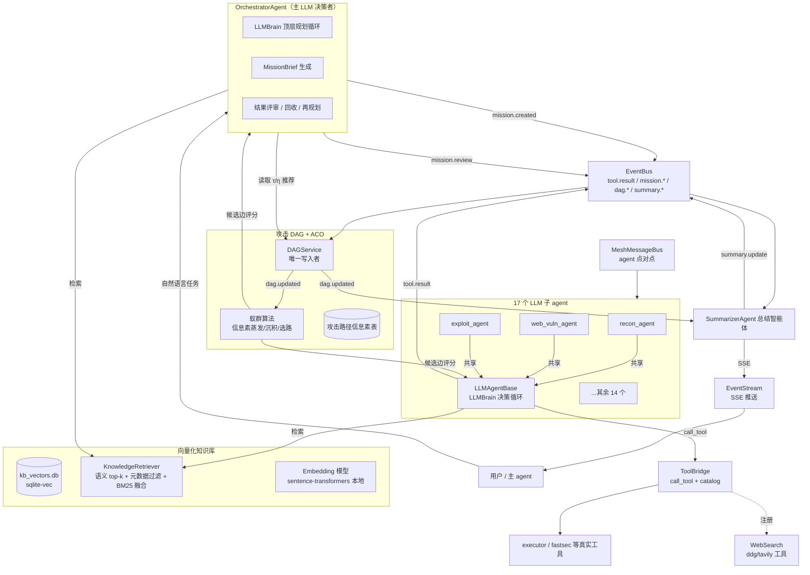

# ARCH_DESIGN — LLM 自主多智能体架构设计

> 分支：`refactor/llm-autonomous` ｜ 日期：2026-08-14 ｜ 作者：架构设计（arch-design）
> 性质：**只读代码 + 设计文档**，不修改任何现有 `.py`。本文档是后续实现 worker 的直接施工依据。
> 目标：把「确定性 17-agent 集群」改造为「LLM 唯一决策者 + 向量化知识库 + DAG/ACO 路径引导 + 实时总结」的自主多智能体系统。

---

## 0. 现状基线（读码结论，非推测）

| 资产 | 现状 | 结论 |
|---|---|---|
| `kali_mcp/core/llm_brain.py` | `LLMBrain`：Claude/OpenAI 双 provider 初始化、`analyze()` 输出决策 JSON、`plan_task`/`repair_decision`/`review_action`、`sanitize_prompt` 术语脱敏、`make_sanitizer` 目标脱敏、`truncate_output`、`is_policy_refusal` | **核心保留、直接复用** |
| `kali_mcp/mcp_tools/llm_react_tools.py` | `llm_auto_pentest`：单 LLM ReAct 循环（ToolBridge + LLMBrain + 脱敏 + 拒答处理 + flag 正则） | **多 agent 形态的种子**，升级为子 agent 循环参考实现 |
| `kali_mcp/core/tool_bridge.py` | `ToolBridge`：`call_tool(name, params)->str` + `get_catalog_prompt()` 按类别生成目录文本 | **保留**，作为所有 agent 的统一工具入口 |
| `kali_mcp/agents/base_agent_v2.py` | `BaseAgentV2`：抽象 `_execute_task_impl`、`_call_tool`（executor 桥）、`MCP_TO_TOOL_NAME_MAP`、`AgentCapability.tools`、`is_tool_failure_output` | **保留**，在此之上加 LLM 层 |
| 17 个子 agent（4 目录） | 每个都是 `execute_task_with_task_obj` → `_execute_task_impl`（**if/else 把 task_type 路由到固定工具调用**）→ `_call_tool` → 正则解析成 `Finding` → `AgentResult` | 决策逻辑**全部替换为 LLM**，工具调用/结果解析保留 |
| `kali_mcp/core/mesh_message_bus.py` | 网状消息总线：路由表、Type/Sender/Content/Priority 过滤器 | 保留（agent 间点对点通信） |
| `kali_mcp/core/event_bus.py` | 进程内同步事件总线，`tool.result` 等事件 + 通配订阅 + 5s 超时 | 保留，**新增事件类型** |
| `kali_mcp/core/event_stream.py` | `EventManager`/`EventEmitter`：per-session 异步队列、SSE 格式化、回调 | **总结智能体的实时推送通道** |
| `kali_mcp/reasoning/knowledge_graph.py` | `VulnerabilityKnowledgeGraph` + `AttackChain`（100+ 预定义链、条件检查） | 降级为 DAG 种子边 + KB 参考条目 |
| `kali_mcp/core/task_decomposer.py` | `Task`/`TaskGraph`（DAG 数据结构）+ `StrategyTemplate` + `TaskDecomposer.decompose` | 数据结构复用为攻击 DAG 雏形；**分解器主路径废弃** |
| `kali_mcp/core/agent_coordinator.py` | `CoordinatorAgent.process_request`：IntentAnalyzer → TaskDecomposer → AgentScheduler → HybridDecisionEngine → 执行 → ResultAggregator | **重构为 LLM orchestrator**（保留 process_request 签名） |
| `kali_mcp/core/playbooks/` | `run_playbook` 注册表（web_surface/api_surface/auth_surface/svc_surface/internal_lateral/stealth/ai_guided/chain） | **移出主路径**，摘要进 KB 作参考 |
| `kali_mcp/core/pentest_capability_planner.py` | 确定性阶段蓝图生成 | 降级为「可选参考」，STAGE_LIBRARY 向量化进 KB |
| `kali_mcp/core/hybrid_decision_engine.py` | 规则/ML 战略+战术决策模型 | **废弃**（LLM 取代） |
| `kali_mcp/core/intent_analyzer.py` | 关键词意图识别 | 仅作 LLM 输入的辅助特征，不作决策者 |
| `kali_mcp/core/result_aggregator.py` | `AgentResult`/`Finding`/`ResultSeverity`/去重/关联/报告 | **保留**，总结智能体复用其模型 |
| `kali_mcp/core/agent_registry.py` + `agent_scheduler.py` | 注册/心跳/能力索引 + 调度 | 保留：registry 用于寻址，scheduler 仅保留容量护栏 |
| `data/` | 内容单薄：`wordlists/CREDENTIALS_GUIDE.md`、`result_cache.sqlite`、`usage.sqlite`、`async_jobs.json`、`taskboard.json` | 向量化对象需**扩源**（见 §8） |
| `requirements.txt` | mcp/anthropic/openai/aiohttp/starlette/flask 等 | 需增量（见 §11） |
| MCP 工具面 | `agent_run`（→CoordinatorAgent）、`agent_status`、`llm_auto_pentest`、board/workflow/harness 工具 | 收口为 LLM 自主入口（见 §10） |

**17 个子 agent（agent_id）**：recon_agent, subdomain_agent, web_recon_agent ｜ web_vuln_agent, vuln_scanner_agent, vuln_verifier_agent, auth_agent, network_vuln_agent ｜ exploit_agent, lateral_agent, privilege_agent ｜ pwn_agent, source_code_agent, forensics_agent, code_audit_agent, crypto_agent, code_analyze_agent

---

## 1. 总体架构

### 1.1 架构图



### 1.2 设计原则（硬约束）

1. **LLM 是唯一决策者**：任何「下一步做什么」的结论必须来自 LLM 决策 JSON。DAG/ACO/知识库只提供**上下文与评分推荐**，可以出现在 LLM 的输入里，但**不得直接触发工具**。
2. **删除预定义主路径**：playbooks、task_decomposer、pentest_capability_planner、确定性编排不再作为执行路径；它们的内容降级为向量化 KB 里的「参考战术」。
3. **复用大于新建**：LLMBrain 的 JSON 协议、脱敏、repair/refusal 处理、`_call_tool`、`Finding` 模型、EventBus、EventStream 全部保留，只做组合与新模块。
4. **降级安全**：LLM 不可用时，子 agent 回退到现有 if/else `_execute_task_impl`（保留代码路径），系统不空转。

---

## 2. 决策一：Orchestrator 与 17 子 agent 的关系

### 2.1 职责划分

| 层 | 谁 | 决策范围 | 决策依据 |
|---|---|---|---|
| 顶层规划 | **OrchestratorAgent**（重构 CoordinatorAgent） | 目标理解、阶段推进（侦察→深挖→利用→验证→收尾）、**派谁去做什么**、结果评审与再规划、终止判定 | LLM + DAG 全局视图 + KB 检索 + ACO 推荐 + 汇总简报 |
| 领域执行 | **17 个子 agent** | 在自己的角色与工具面内：**具体调哪个工具、什么参数、如何解读输出、何时回报** | LLM（角色 prompt）+ 任务简报 + KB 命中 + 该子图的信息素 + 已有 findings |
| 全局观测 | **SummarizerAgent** | 汇总、去重、去误报、严重性排序、实时推送 | 事件订阅（见 §6） |

### 2.2 任务下发 / 回收协议

不采用「orchestrator 直接 await 子 agent」的强耦合，而是 **事件驱动的任务票（Mission Ticket）**：

```
下发：
1. orchestrator 的 LLM 输出 {"action":"dispatch_mission","agent_role":"web_vuln_agent",
   "objective":"验证 /admin 是否存在 SQL 注入点","context":["dag.node.n102","kb.chunk.k17"],
   "constraints":["只读检测，不 dump 数据"],"priority":8}
2. DAGService.add_node(MissionNode)          # 任务本身成为 DAG 节点
3. bus.emit("mission.created", ticket)       # 子 agent 各自订阅 mission.created 并按其 role 认领

认领与执行：
4. 子 agent 收到 mission.created，若 ticket.agent_role == self.agent_id 且自身容量允许
   → 写 ticket.status=running（经 DAGService 更新）→ 启动 LLM 决策循环

回收与再规划：
5. 子 agent 完成 → DAGService.add_node(ResultNode) → bus.emit("mission.completed", ticket)
6. 子 agent 失败/超时（lease TTL，默认 180s，续期走 agent_registry.heartbeat 同机制）
   → bus.emit("mission.failed", ticket) → orchestrator 收到后重新 dispatch
   （同 agent 换 objective 重试，或换 agent，由 LLM 决定）
7. orchestrator 的 review 轮次订阅 mission.completed / dag.updated，
   累计 N 个结果或超时后由 LLM 判定：继续深挖 / 换方向 / 结束(done)
```

**为什么这样设计**：沿用现有 `EventBus` + `AgentRegistry.heartbeat`，避免新增任务队列中间件；MissionTicket 即 DAG 节点，天然满足「子 agent 的发现作为 DAG 节点」；orchestrator 不必持有每个 agent 的协程句柄，天然解耦并发。

---

## 3. 决策二：17 子 agent 的 LLM 化改造

### 3.1 新增基类 `LLMAgentBase(BaseAgentV2)`（新文件 `kali_mcp/agents/llm_agent_base.py`）

在 BaseAgentV2 之上叠加 LLM 能力，**不动** `_call_tool` / `MCP_TO_TOOL_NAME_MAP` / `is_tool_failure_output` / `AgentCapability`：

```python
class LLMAgentBase(BaseAgentV2):
    ROLE_PROMPT: str = ""            # 子类覆写：角色身份、目标、边界、回报标准
    MAX_LLM_ROUNDS: int = 15

    def __init__(self, *args, brain: LLMBrain | None = None, retriever=None,
                 dag_service=None, **kwargs):
        super().__init__(*args, **kwargs)
        # brain 缺省从环境构建（复用 LLMBrain 现有 provider 探测逻辑）
        self.brain = brain or LLMBrain(tool_catalog=self._build_catalog())
        self.retriever = retriever          # 向量检索（§8）
        self.dag_service = dag_service      # DAG 读写（§4）

    def _build_catalog(self) -> str:
        """工具面 = AgentCapability.supported_tools ∩ ToolBridge.registry.tools，
        用 ToolBridge._categorize_tools 生成目录文本（复用现有格式）。"""
        # 例：recon_agent → nmap_scan/masscan_scan/fastsec_scan/...
```

### 3.2 每个子 agent 的三件套（角色 prompt、工具面、决策循环）

**角色 prompt 模板**（`ROLE_PROMPT` 由子类覆写，混入脱敏后的中性语言，参考 `SYSTEM_PROMPT` 风格）：

```
你是 <角色名>，负责 <领域目标> 的专业评估代理。
## 你的工具（仅这些可用）
<子集工具目录>
## 任务简报
<mission.objective + 约束 + 目标>
## 当前攻击图上下文（信息素浓度高的路径优先）
<dag_view 摘录>
## 知识库参考（语义检索命中，前 k 条）
<kb_hits>
## 已知发现（避免重复劳动）
<prior_findings>
## 输出协议
<LLMBrain 决策 JSON：thinking/action(call_tool|run_tool|done)/tool_name/params/reason/plan>
## 边界
1. 只调用列出的工具；2. 复用/截断规则同 llm_react_tools；3. 达到目标或 MAX_LLM_ROUNDS 即 done；
4. done 时必须给出 structured_summary：{findings:[{title,severity,confidence,evidence}], next_hypotheses:[...]}
```

**决策循环**（`llm_drive_mission`，逐字可实现的伪代码）：

```python
async def llm_drive_mission(self, ticket) -> AgentResult:
    sanitize, desanitize = LLMBrain.make_sanitizer(ticket.target)
    messages = [{"role": "user", "content": sanitize(self._build_mission_message(ticket))}]
    step_kb_cache = {}                       # mission 内 KB 检索按步缓存，控 token
    for round_no in range(1, self.MAX_LLM_ROUNDS + 1):
        if round_no == 1 or round_no % 3 == 0:
            kb_hits = self.retriever.retrieve(f"{ticket.objective} {self._last_output_tail}", top_k=4)
            step_kb_cache[round_no] = kb_hits
            messages.append({"role": "user", "content": "## 知识库参考\n" + format_hits(kb_hits)})
        decision = self.brain.analyze(messages)          # 复用 LLMBrain JSON 协议
        action = decision.get("action")
        if action == "retry":                            # 复用 repair_decision / refusal 逻辑
            ...同 llm_react_tools 的处理...
        if action == "done":
            return self._finalize(ticket, decision, messages)
        if action == "call_tool":
            params = {k: desanitize(v) for k, v in (decision.get("params") or {}).items()}
            output = await self._call_tool(decision["tool_name"], params)   # ← 原有 executor 桥，不动
            if not self.is_tool_failure_output(output):                     # 复用失败判定
                self._emit_finding_events(ticket, decision, output)         # 生成 Finding → event
            self.dag_service.add_node(AttackActionNode(...))                # 动作入 DAG
            messages += [{"role": "assistant", "content": sanitize(json.dumps(decision))},
                         {"role": "user", "content": "Tool output:\n" + sanitize(self.brain.truncate_output(output))}]
        # run_tool 同理走 executor
    return self._finalize_timeout(ticket)
```

**复用点（显式列出）**：`LLMBrain.analyze` 的 JSON 协议原样复用（含 retry 语义）；`repair_decision`、`is_policy_refusal`、`truncate_output`、`sanitize_prompt`、`make_sanitizer` 全部照搬 `llm_react_tools.py` 的成熟流程；`_call_tool` 与正则解析器（`_parse_*_output`）原样保留——**LLM 决定调什么，正则负责把输出提炼成 Finding 证据**（结构化证据提取仍是确定性代码，避免 LLM 编造证据文本）。

### 3.3 旧 if/else 的处置

每个子 agent 的 `_execute_task_impl` 保留为**降级回退**，签名不变：

```python
async def _execute_task_impl(self, task_type, task_data, task_id):
    if self.brain.available and task_data.get("llm_autonomous"):
        return await self.llm_drive_mission(MissionTicket.from_task(task_data))
    return await self._execute_task_impl_legacy(task_type, task_data, task_id)  # 原 if/else 路由
```

`execute_task_with_task_obj` 的 `AgentResult` 封装逻辑不动。试点先改 3 个：`recon_agent`、`web_vuln_agent`、`exploit_agent`（覆盖侦察/Web 漏洞/利用三个典型面），其余 14 个按同一模板迁移。

---

## 4. 决策三：攻击 DAG 建模

### 4.1 节点与边（新文件 `kali_mcp/reasoning/attack_dag.py`）

| 节点类型 | 含义 | 示例 | 写入者 |
|---|---|---|---|
| `observation` | 已确认事实 | 开放端口 80/tcp、指纹 nginx/1.18 | 子 agent |
| `hypothesis` | 待验证假设 | 「/admin 可能是 phpMyAdmin」 | 子 agent / orchestrator |
| `attack_action` | 一次已执行的工具调用 | fastsec_scan dir=/admin | 子 agent |
| `finding` | 已验证漏洞/发现 | SQLi at /admin?id=1 (high) | 子 agent / verifier |
| `mission` | 任务票 | 上述 MissionTicket | orchestrator |
| `summary` | 阶段总结 | 汇总快照 | summarizer |

边（带属性 `pheromone τ`、`weight w`、`meta`）：

- `evidence`：observation → hypothesis（支撑）
- `drives`：hypothesis → attack_action（假设驱动动作）
- `yields`：attack_action → observation/finding（动作产出）
- `enables`：finding → hypothesis（利用成果开启新假设）
- `contains`：summary → 其内节点

### 4.2 存储与更新职责（单一写入者模式）

```
唯一写入者：DAGService（单例）
- 所有 agent（含 orchestrator）通过 bus.emit("dag.command", {op, payload}) 提交变更意图
- DAGService 订阅 dag.command，串行 apply（asyncio.Lock），校验无环（复用
  TaskGraph.validate 的 DFS 思路），落库后 emit("dag.updated", {delta, snapshot_hash})
- 持久化：data/attack_dag.sqlite（表 nodes/edges/pheromone，按 session_id 隔离）
- 读接口：get_subgraph(node_id, depth)、get_frontier(max_hypotheses)、
  get_pheromone_view(agent_role) → 供 LLM 输入的压缩 DAG 视图
- 无环不变量：攻击图方向严格 evidence→hypothesis→action→finding，禁止反向/回边
```

`TaskGraph`（task_decomposer）的 `add_task/get_ready_tasks/validate` 数据结构思想直接搬入 AttackDAG（复用代码，标注来源），但语义从「预规划任务图」改为「执行过程事实图」。

---

## 5. 决策四：蚁群算法 ACO 落地（新文件 `kali_mcp/reasoning/aco.py`）

### 5.1 信息素定义

- 信息素 **τ 沉积在边上**（边 = 一次「从 X 深入 Y」的攻击路径段），τ ∈ [0.05, 1.0]，初始化 0.1。
- 沉积触发：下游 `finding`/`observation` 节点被 `vuln_verifier` 或平台 flag 判定**成功**时，沿 `enables`/`yields` 路径回溯沉积：

```
Δτ_e = deposit_rate · success_signal · (1 + sev_weight)
success_signal ∈ [0,1]：verifier 置信度 / 平台验证得分；无 verifier 时 = agent 自报 confidence
sev_weight：CRITICAL=1.0, HIGH=0.6, MEDIUM=0.3, LOW=0.1, INFO=0
deposit_rate 默认 0.15（配置项）
τ_e ← min(1.0, τ_e + Δτ_e)
```

### 5.2 蒸发机制

```
每 TICK（默认每新增 5 个节点 或 60s，取先到者）：
τ_e ← max(0.05, (1 − ρ) · τ_e)        # ρ 默认 0.10（配置项）
```

### 5.3 启发式定义（节点/边打分，全部归一化到 [0,1]）

```
η_e = w1·severity_norm(e)   # 目标 finding 严重性（CVSS/10 或等级映射）
    + w2·kb_sim(e)          # KB 检索对候选假设的相似度（§8 top-1 分数）
    + w3·target_rel(e)      # orchestrator 给的目标相关性优先级（0~1）
    - w4·cost_norm(e)       # 预估耗时/10min 截断
    - w5·fail_rate(e)       # 该工具/该方向的历史失败率（performance_metrics）
默认 w = [0.4, 0.3, 0.2, 0.05, 0.05]，Σw=1.0
```

### 5.4 选路公式（ant = 被派往某子图的子 agent）

```
候选边集合 C(n) = 节点 n 的可达前沿边（DAGService.get_frontier 输出）
P(e) = τ_e^α · η_e^β  /  Σ_{e'∈C(n)} τ_{e'}^α · η_{e'}^β     # α=1, β=2（默认）
```

### 5.5 与 LLM 的接口（关键约束：ACO 只推荐、不决策）

```python
def recommend_next(n: str, agent_role: str, k: int = 5) -> list[EdgeScore]:
    """按 P(e) 降序返回 top-k 候选边，附 τ/η/P 分解值。"""
def select_next(n: str) -> EdgeScore:
    """按 P(e) 轮盘赌采样（用于 LLM 未明确选向时的兜底展示）。"""
```

orchestrator / 子 agent 的 LLM 输入中注入：

```
## 蚁群推荐（信息素 + 启发式融合，仅参考，你来决定）
1. edge e12 (n102→n105): P=0.31 τ=0.72 η=0.55 「对 /admin 的 SQL 参数检测」
2. edge e09 (n102→n103): P=0.18 τ=0.40 η=0.48 「目录枚举」
```

LLM 可以在 `plan`/`reason` 字段里引用或否决推荐；**否决本身作为负反馈**（`fail_rate` 更新，间接影响 η）。这样同时满足「LLM 唯一决策者」与「信息素指导路径」。

---

## 6. 决策五：总结智能体 SummarizerAgent（新文件 `kali_mcp/core/summarizer_agent.py`）

### 6.1 订阅的事件（EventBus）

| 事件 | 用途 |
|---|---|
| `mission.completed` / `mission.failed` | 采集 AgentResult |
| `tool.result`（过滤 critical/high 关键词命中） | 即时线索 |
| `vuln.verified` | 最高可信发现 |
| `dag.updated` | 触发增量汇总 |
| `flag.found` | 立即高优推送 |

### 6.2 汇总流水线（纯函数，可单测）

```
1. 规范化：每个输入 → Finding（复用 result_aggregator.Finding）
2. 去重：fingerprint = sha1(f"{target}|{finding_type}|{title}|{首条evidence}")
   → 同 fingerprint 保留 confidence 最高者，合并 evidence 列表
3. 去误报：三层过滤
   a. 硬过滤：is_tool_failure_output / executor 拒绝标记（复用）→ 丢弃
   b. 阈值：confidence < 0.6 标记 low_confidence（不丢弃，降级展示）
   c. LLM 辅助研判：批量（≤20 条/次）交 LLM 三分类 {confirmed, suspicious, false_positive}，
      仅当 3b 通过且证据非空时调用，控 token；LLM 不可用跳过
4. 排序：severity 序 CRITICAL>HIGH>MEDIUM>LOW>INFO → CVSS 降序 → confidence 降序 → 时间升序
5. 产出 SummarySnapshot {session_id, updated_at, findings[], stats{agents_active,
   nodes_total, paths_pheromone_top3}, flags[], next_best_path[]}
```

### 6.3 实时推送（复用 event_stream，不新增通道）

- 每条 `summary.update` 写 EventBus（进程内订阅者：orchestrator 的 review 轮 + 主 agent 的 `MainAgentSubscriber` 回调）；
- 同时调用 `EventManager.create_emitter(session_id)` 的 `emit_finding/emit_flag_found/emit_phase_complete/emit_info` 发 SSE——**现有前端/主 agent 的 event_stream 通道直接可见**，无需新协议；
- 节流：同一 session 每 2s 最多一条汇总推送（合并批量 delta）。

---

## 7. 决策六：向量化知识库

### 7.1 选型

| 项 | 决策 | 理由 |
|---|---|---|
| Embedding | **默认本地 `sentence-transformers`**（`BAAI/bge-small-zh-v1.5`，512 维，权重随仓库提供于 `data/models/`）；配置可切 OpenAI `text-embedding-3-small` | 离线、零 API 成本、与现有「本地 lab」定位一致；LLM provider 已有 key 时可切 API 提质量 |
| 向量库 | **`sqlite-vec`**（单文件 `data/kb_vectors.db`），`chromadb` 作为规模兜底 | 与仓库 data/*.sqlite 惯例一致、零新服务；KB 预估几千 chunk，暴力检索足够（见不确定点 U2） |
| 混合检索 | `rank-bm25` 关键词召回 + 向量召回做 **RRF 融合** | 工具名/CVE 编号等专名靠关键词更稳 |

### 7.2 数据源与切分（`scripts/build_kb_index.py` + `kb_sources.yaml`）

```
kb_sources.yaml 声明（含 include/exclude glob、每源 category 元数据）：
- data/wordlists/*.md                  category: credentials
- doc/runbook-internal.md              category: runbook
- doc/能力升级总计划.md                 category: strategy
- docs/writeups/*.md                   category: writeup
- docs/plans/*.md                      category: plan
- tools_recipes/*.yaml                 category: recipe
- kali_mcp/core/playbooks/*.py         category: playbook_ref   # 仅 docstring 摘录
- kali_mcp/reasoning/knowledge_graph.py#AttackChain → 结构化条目 category: chain
- 新增: docs/kb/ 目录（人工沉淀的漏洞类型/绕过技巧/工具手册，首期 5~10 篇）
```

切分规则：Markdown/YAML 感知 —— 按标题层级分节、代码块整体保留、正文按段落聚合，目标块 300~800 字符、相邻块重叠 50 字符；每条记录 `{id, source, section_path, text, embedding, meta{category, tool, vuln_type, tags}, content_hash}`；增量重建按 content_hash 跳过未变文件。

### 7.3 检索接口（`kali_mcp/reasoning/knowledge_retriever.py`）

```python
class KnowledgeRetriever:
    def retrieve(self, query: str, top_k: int = 5,
                 filters: dict | None = None) -> list[KbHit]:
        """filters 例：{category:"credentials", tool:"fastsec"}；
        向量 top_k×3 召回 + BM25 top_k×3 召回 → RRF 融合 → 过滤 → top_k。"""
class KbHit:  # dataclass
    chunk_id, source, section, text, score, meta
```

### 7.4 agent 如何调用

- **下发时**：orchestrator 生成 MissionBrief 前，用 `objective + target 类型` 检索，把命中 chunk 摘要嵌入 brief（每条 ≤200 字符，共 ≤5 条）；
- **执行中**：子 agent 每 3 步注入一次 KB 参考块（§3.2 伪代码中的 `step_kb_cache`），mission 内命中缓存去重，控制 token 增长；
- 检索失败/库为空 → 静默跳过该块，不阻塞决策循环（降级安全）。

---

## 8. 决策七：联网搜索

| 项 | 决策 |
|---|---|
| 后端 | **`duckduckgo-search` 为主**（免费无 key、纯 Python）；可选 `tavily-python`（质量更高、需 key）作为配置切换后端 |
| 接入形式 | **注册为 ToolBridge 的普通工具** `web_search(query, max_results)` 与 `web_fetch(url)`，进入 `get_catalog_prompt()` 目录 → orchestrator 和子 agent 都能在标准 call_tool 路径里调用 | 

理由：工具面统一（LLM 自选何时搜）、`tool.result` 事件天然留审计日志、无需为搜索做特殊旁路。实现为 `WebSearchBackend` 接口（ddg/tavily 两实现），`web_fetch` 用 httpx（已依赖）抓正文（复用 reader 清洗思路）。

---

## 9. 决策八：预定义路径迁移方案（删/留/废弃）

| 组件 | 处置 | 去向 |
|---|---|---|
| `playbooks/*`（含 `run_playbook`） | **移出主路径**，代码保留 | MCP 侧 `run_surface_chain` 默认不注册（`K4_LEGACY_PLAYBOOKS=1` 显式开启过渡）；playbook 摘要向量化进 KB 作「参考战术」 |
| `task_decomposer.py` | **主路径废弃** | `Task`/`TaskGraph` 数据类**保留**（转给 AttackDAG 复用 + 兼容垫片，标注 `@deprecated`）；`StrategyTemplate`/`TaskDecomposer.decompose` 删除 |
| `pentest_capability_planner.py` | **降级为可选参考** | `build_strategy` 不再被 orchestrator 调用；`STAGE_LIBRARY` 向量化进 KB |
| `hybrid_decision_engine.py` | **废弃** | 战略/战术决策由 LLM 取代；决策 dataclass 保留给观测日志 |
| `intent_analyzer.py` | **降级为辅助特征** | `analyze()` 结果作为 orchestrator 首条消息的附加特征（目标类型/约束提示），不作决策依据 |
| `agent_coordinator.py` | **重构** | 保留 `CoordinatorAgent.process_request` 签名与 `ExecutionSession`；内部 IntentAnalyzer+TaskDecomposer+HybridDecisionEngine 替换为 §2/§5 的 LLM+DAG+ACO 流程；ResultAggregator 保留 |
| `knowledge_graph.py` | **降级** | `AttackChain` 转为 DAG 种子边候选 + KB 条目，不作为唯一推理器 |
| `agent_scheduler.py` | **保留（瘦身）** | 仅保留过载/容量护栏（`is_overloaded` 检查），agent 选择交给 LLM |
| `agent_registry.py` | 保留 | 寻址 + 心跳 + 能力/工具索引（供 MissionTicket 认领与 DAG 归属） |
| `agent_live.py` | 保留 | 展示层；新事件类型沿用其日志/事件 hook 即可 |
| MCP 工具面 | **收口** | `agent_run` 内部改走 LLM orchestrator（保留名字、语义升级）；新增 `llm_agent_run`（多 agent 自主入口，等价实现）；`agent_status` 保留；新增观测工具 `dag_status`、`kb_search`；`llm_auto_pentest` 保留并升级（内部加 KB/搜索/DAG 上下文） |

---

## 10. 决策九：依赖清单（requirements.txt 增量）

```
# ---- LLM 自主多智能体（新增）----
# 向量化知识库
sentence-transformers>=2.7.0        # 本地 embedding（首次运行自动下载模型，需联网一次）
sqlite-vec>=0.1.6                   # 向量存储（单文件，无服务）；规模不达标时换 chromadb>=0.4.0
rank-bm25>=0.2.2                    # 关键词召回（混合检索）
# 联网搜索
duckduckgo-search>=6.3.0            # 默认搜索后端
tavily-python>=0.3.0                # 可选后端（需 TAVILY_API_KEY）
# 数值
numpy>=1.24.0                       # 向量运算（通常已随其他依赖安装，显式声明）
```

模型权重（下载到仓库，实现阶段执行）：`sentence-transformers/paraphrase-multilingual-MiniLM-L12-v2`（或 bge-small-zh-v1.5）→ 仓库 `data/models/`，`HF_HOME` 指向该目录，保证离线可跑。

---

## 11. 决策十：数据流总览 + 分阶段实施

### 11.1 一次完整请求的数据流（时序）

```
U 提交任务
 → ORCH: LLM 顶层规划（输入：任务 + KB 检索 + 空 DAG）→ dispatch_mission(web_vuln_agent, ...)
 → DAGService: add_node(mission) → emit dag.updated
 → web_vuln_agent 认领 → LLM 决策循环：
    每步：KB 命中(缓存) + DAG/τ 视图 → analyze → call_tool(fastsec_scan, ...)
     → _call_tool → executor → tool.result 事件 → 正则解析 → Finding
     → DAGService.add_node(action/observation/finding) → emit dag.updated
 → ACO: 对新增 finding 路径沉积 τ；每 tick 蒸发；产出候选边评分
 → SUMMARIZER: 订阅汇总 → 去重/去误报/排序 → summary.update(EventBus) + SSE(EventStream)
 → ORCH review 轮：读 summary + DAG 视图 → 继续 dispatch / 换向 / done
 → done → 最终 SummarySnapshot → 报告（复用 result_aggregator.generate_report）
```

### 11.2 新模块划分

```
kali_mcp/
├─ core/
│  ├─ llm_brain.py            # 复用（唯一改动：允许注入 role prompt 模板参数，向后兼容）
│  ├─ tool_bridge.py          # 复用 + 注册 web_search/web_fetch（可选搜索后端）
│  ├─ agent_coordinator.py    # 重构 → OrchestratorAgent（LLM 循环版）
│  ├─ summarizer_agent.py     # 新增
│  └─ ...（event_bus / event_stream / registry / scheduler 保留）
├─ agents/
│  ├─ llm_agent_base.py       # 新增：LLMAgentBase + MissionTicket + 决策循环
│  └─ .../（17 个子 agent：加 ROLE_PROMPT + brain 注入 + 降级路由）
├─ reasoning/
│  ├─ attack_dag.py           # 新增：DAGService + 节点/边模型 + sqlite 持久化
│  ├─ aco.py                  # 新增：信息素表/蒸发/沉积/选路
│  └─ knowledge_retriever.py  # 新增：检索接口（复用向量库）
├─ mcp_tools/
│  ├─ multi_agent_tools.py    # 收口：agent_run → LLM orchestrator；新增 dag_status/kb_search
│  └─ llm_react_tools.py      # 升级：注入 KB/DAG/搜索上下文
scripts/
├─ build_kb_index.py          # 新增：切分 + embedding + 入库（幂等增量）
└─ kb_sources.yaml            # 新增：数据源清单
data/
├─ kb_vectors.db              # 向量库（构建产物）
├─ attack_dag.sqlite          # DAG 持久化（运行产物）
└─ models/                    # 本地 embedding 权重
```

### 11.3 分阶段实施（每阶段独立可验证）

**P0 — 向量化知识库（无依赖，最先做）**
- 改动文件：`scripts/build_kb_index.py`（新）、`kb_sources.yaml`（新）、`kali_mcp/reasoning/knowledge_retriever.py`（新）、`tests/test_kb_index.py`（新）、`requirements.txt`（增量）
- 验收：脚本在空库上构建成功；10 条人工查询的 top-5 命中率 ≥ 0.7（人工标定）；增量重建只处理变更文件；完全离线可跑（模型在 data/models）
- 前置：无

**P1 — 子 agent LLM 化（依赖 P0 可选）**
- 改动文件：`kali_mcp/agents/llm_agent_base.py`（新）、`recon_agent.py`/`web_vuln_agent.py`/`exploit_agent.py`（试点改造）、`base_agent_v2.py`（加 brain 注入点，不破坏构造签名）
- 验收：`agent_live.py "对 http://localhost:8000/ 做端口和服务识别" --agents recon` 走 LLM 决策路径并产出与旧路径等价的 Finding；`is_tool_failure_output` 过滤生效；拔掉 API key 后自动回退旧 if/else 路径
- 前置：P0（未完成时 `retriever=None` 跳过 KB 块，不阻塞）

**P2 — 攻击 DAG + ACO（无依赖，可与 P0/P1 并行）**
- 改动文件：`kali_mcp/reasoning/attack_dag.py`（新）、`kali_mcp/reasoning/aco.py`（新）、`tests/test_attack_dag_aco.py`（新）
- 验收：单测覆盖——沉积单调有界（τ∈[0.05,1]）、蒸发收敛、`P(e)` 归一化、无环不变式（非法回边被拒）、并发写入串行化、sqlite 落盘重载一致
- 前置：无

**P3 — Orchestrator + Summarizer 接线（依赖 P0/P1/P2）**
- 改动文件：`agent_coordinator.py`（重构为 LLM 循环）、`summarizer_agent.py`（新）、`event_bus.py`（新事件类型常量）、`mcp_tools/multi_agent_tools.py`（agent_run 转发）
- 验收：对本地靶机（`to_player/` 或 fastsec 可扫目标）端到端跑通：dispatch → 子 agent 执行 → DAG 更新 → ACO 沉积 → 汇总 → SSE 推送可见（`agent_live.py` 与 event_stream 客户端均可见）；mission 超时回收后 orchestrator 能再规划
- 前置：P0、P1、P2

**P4 — 搜索 + 工具面收口（依赖 P1/P3）**
- 改动文件：`tool_bridge.py`（注册 web_search/web_fetch）、`search_backends.py`（新）、`multi_agent_tools.py`（dag_status/kb_search、legacy 开关）、playbooks 注册表摘除（env 开关）
- 验收：`web_search` 出现在 catalog 并可经 call_tool 调用；`agent_run` 默认走 LLM orchestrator；`K4_LEGACY_PLAYBOOKS=1` 时旧 playbook 工具仍可用（过渡）
- 前置：P1、P3

**P5 — 加固与验收（依赖 P0–P4）**
- 改动文件：`benchmark.py`（扩展 LLM 自主模式指标：路径命中率/信息素收敛速度/每任务 token 成本）、配置参数（α/β/ρ/w、deposit_rate、TTL）、`doc/能力升级总计划.md` 更新
- 验收：同一基准目标集上 LLM 自主模式与旧确定性模式对比报告（发现数/耗时代价/token 成本）；τ 分布可视化收敛；剩余 14 个子 agent 按 P1 模板迁移完成
- 前置：P0–P4

---

## 12. 诚实的不确定点（需实现阶段实测，勿拍脑袋）

- **U1 Embedding 选型**：本地小型多语模型 vs API embedding 的检索质量差异需用人工标定查询集实测；若本地命中率 < 0.7 则默认切 API（P0 验收即决定）。
- **U2 向量库规模**：sqlite-vec 暴力检索在 >10 万 chunk 时延迟不可控；KB 当前量级（千级 chunk）无压力，规模增长后实测决定是否换 chromadb（接口已抽象，切换成本低）。
- **U3 搜索后端可用性**：duckduckgo-search 有速率限制/被墙风险（lab 环境）；tavily 需 key。接口抽象保证后端可换，但「默认后端在目标网络可达性」需现场验证。
- **U4 ACO 参数**：α/β/ρ/w 的默认值是启发式初值（源自经典 ACO 经验），需在真实/基准目标上做小网格搜索校准；P5 阶段给出收敛性证据。
- **U5 token 成本**：每步注入 KB 参考 + DAG 视图会线性增加每轮 token；`step_kb_cache`/视图压缩（depth 限制、top-3 τ 路径）是缓解手段，实际增速需在 P3/P5 测量并定预算上限。
- **U6 主 agent 实时性**：EventBus 是同步进程内总线，summarizer 的 LLM 三分类研判若拖慢推送，需把研判改为异步批次（设计已含，实现时验证 2s 节流是否足够）。

---

## 附录 A：决策 JSON 协议（子 agent 扩展）

LLMBrain 现有 action 集合 `call_tool|run_tool|done|retry` 保持不变（完全复用解析/修复/拒答管线），子 agent 仅新增两个约定字段，不新增 action：

```json
{
  "thinking": ["..."],
  "action": "call_tool",
  "tool_name": "fastsec_scan",
  "params": {"url": "TARGET/admin", "inject": "id"},
  "reason": "验证 /admin 的 SQL 参数检测（蚁群推荐边 e12）",
  "plan": ["下一假设"],
  "confidence": 0.82,
  "hypothesis_id": "h17"
}
```

`done` 时要求 `structured_summary`（见 §3.2 模板）。orchestrator 的 action 集为 `dispatch_mission|review|done`（新协议，独立 system prompt，复用同一 `_parse_decision_json` 管线）。

## 附录 B：MissionTicket 结构

```python
@dataclass
class MissionTicket:
    mission_id: str          # 全局唯一，即 DAG 节点 id
    session_id: str
    agent_role: str          # 目标子 agent（registry 寻址）
    objective: str           # LLM 生成的目标陈述
    target: str              # 真实目标（LLM 侧脱敏为 TARGET_HOST）
    context_refs: list[str]  # [dag.node.x, kb.chunk.y] 引用
    constraints: list[str]   # 授权/不破坏性约束（来自 sanitize_prompt 摘要）
    priority: int            # 1-10
    status: str              # pending|running|completed|failed|expired
    lease_expires_at: float  # 回收 TTL
    result_ref: str | None   # AgentResult / DAG 结果节点 id
```
