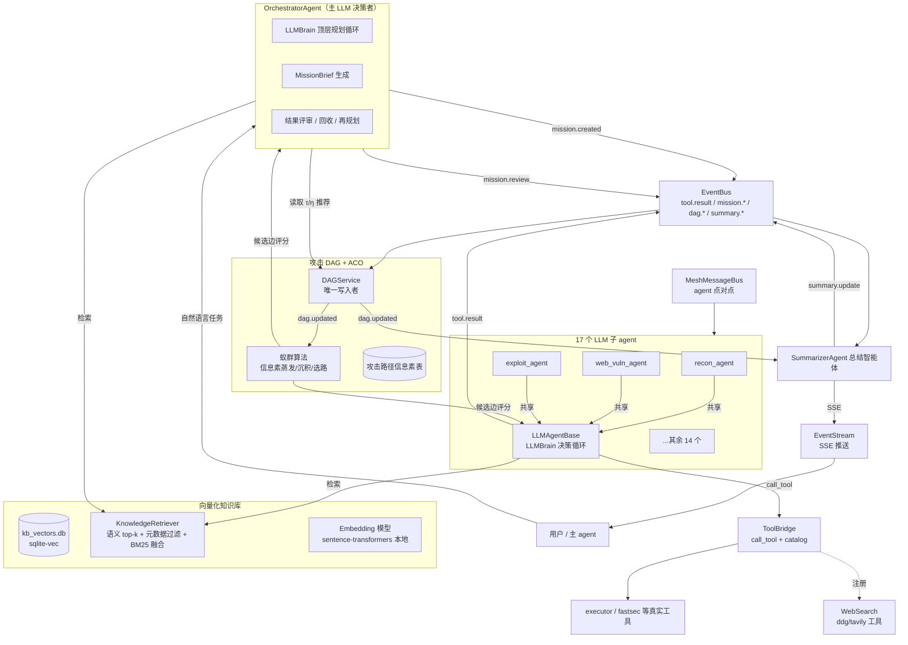

# Kali MCP — LLM 自主多智能体渗透系统

<div align="center">


**深度推理增强的 LLM 自主多智能体渗透系统：LLM 是唯一决策者**

*一条自然语言指令 → LLM 顶层规划 → 17 个 LLM 自主智能体逐步动态规划 → 攻击 DAG + 蚁群算法路径引导 → 向量化知识库 + 联网搜索增强 → 实时总结推送*

[中文](#中文) | [English](#english)

</div>

---

## 中文

### 定位

Kali MCP 是一套 **LLM 自主多智能体渗透系统**：LLM 是**唯一决策者**，依据「向量化知识库 + 联网搜索 + 自身能力」逐步动态规划下一步，而不是沿预定义路径执行。1 个 **OrchestratorAgent**（主 LLM 决策者）负责顶层规划与派活，**17 个子 agent 各自都是 LLM 自主智能体**（角色 prompt + 工具面 + LLMBrain 决策循环），它们的发现沉淀为**攻击 DAG 节点**，**蚁群算法（ACO）** 在攻击路径上沉积信息素（成功置信度）为后续行动提供**推荐**（仅推荐，不决策），最终由 **SummarizerAgent** 去重、去误报、排序并实时推送（SSE）给主 agent 与用户。

无 LLM 密钥时系统**依然可以运行**：自动降级到 legacy 确定性路径（子 agent 回退到原规则路由，`K4_LEGACY_CLUSTER=1` 集群照常可用）——但那是**回退模式**，本项目的核心竞争力是 **LLM 自主决策的深度推理渗透**。

### 架构



### 核心能力

| 能力 | 说明 | 代码模块 |
|---|---|---|
| **LLM 是唯一决策者** | 任何「下一步做什么」的结论都来自 LLM 决策 JSON（`call_tool / run_tool / done / retry`）。DAG、ACO、知识库只作为**上下文与评分推荐**注入 LLM 输入，**不得直接触发工具**。顶层规划由重构后的 orchestrator 执行（LLM 循环：目标理解 → dispatch_mission → 结果评审 → 再规划 → 终止判定） | `kali_mcp/core/llm_brain.py`、`kali_mcp/core/agent_coordinator.py` |
| **17 个 LLM 自主子 agent** | 每个子 agent 继承 `LLMAgentBase`：角色 prompt（ROLE_PROMPT）+ 工具面（`AgentCapability.supported_tools ∩ ToolBridge` 注册表）+ `llm_drive_mission` 决策循环。任务以 **MissionTicket**（即 DAG 节点）经 `mission.created` 事件下发、按角色认领。工具调用仍走原 `_call_tool` executor 桥，输出由确定性正则提炼成 Finding 证据（结构化证据提取保持确定性，避免 LLM 编造） | `kali_mcp/agents/llm_agent_base.py` |
| **攻击 DAG + 蚁群算法（ACO）** | 子 agent 的发现（observation / hypothesis / attack_action / finding / mission / summary）作为 DAG 节点，边承载信息素 τ ∈ [0.05, 1]。验证/平台判定成功时沿 `enables`/`yields` 路径**沉积信息素**，定期蒸发，`P(e) = τ^α·η^β` 归一化后给出候选边评分。**诚实说明：ACO 只做路径推荐（top-k 候选边），LLM 可以采纳、引用或否决——否决本身作为负反馈进入启发式；LLM 才是决策者** | `kali_mcp/reasoning/attack_dag.py`、`kali_mcp/reasoning/aco.py` |
| **总结智能体 SummarizerAgent** | 订阅 `mission.completed/failed`、`tool.result`（critical/high 过滤）、`vuln.verified`、`dag.updated`、`flag.found`；流水线：规范化 → sha1 指纹去重 → 三层去误报（硬过滤 / confidence 阈值 / LLM 三分类研判）→ 严重性排序 → `SummarySnapshot`；经 EventBus + EventStream 实时 SSE 推送（同 session 2s 节流，`flag.found` 立即高优推送） | `kali_mcp/core/summarizer_agent.py` |
| **向量化知识库** | 本地 `sentence-transformers` embedding + `sqlite-vec` 单文件向量库（`data/kb_vectors.db`）+ `rank-bm25` 关键词召回，**RRF 融合**。orchestrator 下发任务前与子 agent 执行中（每 3 步）注入 KB 命中块，语义检索经验库（战术 / writeup / 口令 / 绕过技巧等）。索引构建幂等增量（`content_hash` 跳过未变文件） | `kali_mcp/reasoning/knowledge_retriever.py`、`scripts/build_kb_index.py`、`scripts/kb_sources.yaml` |
| **联网搜索** | `web_search` / `web_fetch` 注册为 ToolBridge 普通工具（进入工具目录，走标准 `call_tool` 路径，天然留审计日志），LLM 自主决定何时搜索 CVE / 漏洞情报 / 绕过技巧。后端按 `WEB_SEARCH_BACKEND=ddg\|tavily` 切换（默认 ddg 免费无 key） | `kali_mcp/core/search_backends.py`、`kali_mcp/core/tool_bridge.py` |

### 17 个 LLM 自主子 agent

每个子 agent 都是一个 **LLM 自主智能体**：用自己的角色 prompt、自己的工具面、自己的 LLMBrain 决策循环，在任务简报、知识库命中、攻击图信息素视图与已有发现的上下文中逐步决定「调哪个工具、什么参数、如何解读输出、何时回报」。工具调用失败判定与结构化证据提取仍是确定性代码。

| 分组 | 智能体 | 职责 |
|---|---|---|
| **信息收集** | `recon_agent` | 端口扫描 / 服务识别 / OS 指纹 / 拓扑侦察 |
| | `subdomain_agent` | 子域名枚举 / DNS 记录 / OSINT |
| | `web_recon_agent` | 目录枚举 / 技术栈识别 / WAF 检测 / CMS 指纹 |
| **漏洞发现** | `vuln_scanner_agent` | CVE / 模板化漏洞扫描 |
| | `web_vuln_agent` | SQLi / XSS / 命令注入等 Web 漏洞 |
| | `auth_agent` | 在线爆破 / 哈希破解 / 凭据喷洒 |
| | `network_vuln_agent` | SMB 枚举 / LLMNR 投毒 / MITM / 嗅探 |
| | `vuln_verifier_agent` | 候选漏洞验证 / PoC 构造 / 利用确认 |
| **利用** | `exploit_agent` | Metasploit / exploit 搜索 / 反弹 shell |
| | `privilege_agent` | Linux / Windows 提权向量分析 |
| | `lateral_agent` | DCSync / Kerberoast / AD 攻击 / 凭据重用 |
| **专门** | `code_analyze_agent` | 白盒源码树扫描 / 危险模式分析 |
| | `code_audit_agent` | SAST 静态分析 / 危险模式搜索 |
| | `crypto_agent` | CTF 密码学 / 编码识别 / 哈希破解 |
| | `forensics_agent` | 隐写 / 内存取证 / 文件系统取证 / 流量分析 |
| | `pwn_agent` | 二进制漏洞检查 / 逆向 / 反编译 |
| | `source_code_agent` | .git/.svn 泄露 / 备份扫描 / LFI 读源码 |

> 迁移状态（按 ARCH_DESIGN §3.3 分阶段实施）：`recon_agent` / `web_vuln_agent` / `exploit_agent` 三个试点已上线 LLM 决策路径（覆盖侦察 / Web 漏洞 / 利用三个典型面），其余 14 个按同一模板迁移中；未迁移前自动回退 legacy 规则路径，系统不空转。

### 快速开始

#### 方式一：MCP（自然语言编排）

在支持 MCP 的客户端（Claude Desktop / Claude Code / Oh My Pi）配置：

```json
{
  "mcpServers": {
    "kali": {
      "command": "python",
      "args": ["mcp_server.py", "--tool-profile", "harness"],
      "env": {
        "KALI_MCP_FORCE_ENABLE_MODULES": "multi_agent",
        "K4_LEGACY_CLUSTER": "1",
        "LLM_PROVIDER": "anthropic",
        "ANTHROPIC_API_KEY": "sk-ant-..."
      }
    }
  }
}
```

- `--tool-profile harness`：harness 档位，暴露编排与观测工具面；
- `KALI_MCP_FORCE_ENABLE_MODULES=multi_agent`：强制启用多智能体模块；
- `K4_LEGACY_CLUSTER=1`：启用多智能体集群初始化（名称保留自旧版，语义升级为 LLM orchestrator 入口）；**配置 LLM key 后走 LLM 自主路径，无 key 时集群降级到 legacy 确定性路径，两者均可用**。

harness 档位下的核心工具：

| 工具 | 用途 |
|---|---|
| `agent_run` | 自然语言任务 → LLM orchestrator 全流程（LLM 顶层规划 → dispatch_mission → 子 agent LLM 决策循环 → review → 汇总） |
| `agent_status` | 集群健康 / agent 列表 / 能力摘要 / 调度统计 |
| `dag_status` | 观测攻击 DAG 全局状态：节点/边数、信息素 top 路径、前沿候选边 |
| `kb_search` | 直接查询向量化知识库（`KnowledgeRetriever.retrieve`，语义 + 关键词混合检索） |

另有 `start_task` / `task_*` / `verify_finding` 等任务板与验证工具。预定义 playbook（`run_playbook` / `run_surface_chain`）已**移出主路径**（战术内容向量化进 KB 作参考），仅设置 `K4_LEGACY_PLAYBOOKS=1` 时作为过渡期兼容注册。

#### 方式二：CLI 实时可视化

```bash
# Windows
C:/Windows/py.exe -3 agent_live.py "对 http://localhost:8000/ 做 web 漏洞扫描：目录枚举、CMS识别、注入检测" --no-cache --timeout 300

# Linux / macOS
python3 agent_live.py "对 http://localhost:8000/ 做 web 漏洞扫描" --agents recon,web_vuln --no-cache
```

`agent_live.py` 是纯展示层：逐行分色打印 orchestrator 的规划/派活决策、每个子 agent 的 LLM 决策与工具调用结果、findings 与总结推送，Windows Terminal 分屏即可获得类 tmux 的实时观察体验。`--agents` 可按 agent_id 精确或前缀匹配（如 `recon` 匹配 `recon_agent`）。

### LLM Provider 配置

决策循环由 `kali_mcp/core/llm_brain.py` 的 `LLMBrain` 驱动，双 provider 支持，全部走环境变量：

| 环境变量 | 说明 |
|---|---|
| `LLM_PROVIDER` | 显式指定 provider：`anthropic`（或 `claude`）/ `openai`（或 `codex`）。不设时自动探测：存在 `OPENAI_API_KEY` 走 OpenAI，否则走 Claude |
| `ANTHROPIC_API_KEY`（或 `ANTHROPIC_AUTH_TOKEN`） | Claude provider 密钥 |
| `ANTHROPIC_MODEL` | Claude 模型名（默认见 `LLMBrain.DEFAULT_MODEL_CLAUDE`） |
| `ANTHROPIC_BASE_URL` | 自定义 Claude 端点（自动补 `/v1` 后缀，兼容代理/网关） |
| `OPENAI_API_KEY`（或 `OPENAI_AUTH_TOKEN`） | OpenAI provider 密钥 |
| `OPENAI_MODEL` | OpenAI 模型名（默认见 `LLMBrain.DEFAULT_MODEL_CODEX`） |
| `OPENAI_BASE_URL` | 自定义 OpenAI 端点（兼容代理 / 兼容网关） |

**无任何 LLM key**：`LLMBrain.available = False`，子 agent 自动回退 legacy 确定性路径（`kali_mcp/agents/*/_execute_task_impl_legacy`），集群照常运行、不空转；但 LLM 自主决策（动态规划、语义检索、ACO 引导、联网情报）不可用——**那不是本项目的常态模式**。

联网搜索可选配置：`WEB_SEARCH_BACKEND=ddg|tavily`（默认 `ddg`）；切 `tavily` 需 `TAVILY_API_KEY`。

### 依赖说明

```text
sentence-transformers>=2.7.0    # 本地 embedding（paraphrase-multilingual-MiniLM-L12-v2，384 维；
                                # 中文场景可换 BAAI/bge-small-zh-v1.5）
sqlite-vec>=0.1.6               # 单文件向量库 data/kb_vectors.db（无服务）
rank-bm25>=0.2.2                # 关键词召回，与向量召回 RRF 融合
duckduckgo-search>=6.3.0        # 默认搜索后端（免费无 key；8.x 起包名迁移为 ddgs，代码两者兼容）
# 可选：tavily-python>=0.3.0    # 质量更高的搜索后端（需 TAVILY_API_KEY）
```

**Embedding 模型已随仓库提供**：权重在 `data/models/`（`paraphrase-multilingual-MiniLM-L12-v2`），完全离线可跑；重新构建/增量更新知识库索引：

```bash
python scripts/build_kb_index.py   # 幂等增量：按 content_hash 跳过未变文件
```

### 合规声明

本项目仅用于**已获书面授权**的渗透测试、CTF 竞赛、安全研究与防御性评估。使用前通过 `set_engagement_context` 声明授权范围；越权扫描、破坏性操作、未授权攻击严格禁止。使用者须自行确保对目标的所有操作均符合适用法律法规。

### License

MIT License — 详见 [LICENSE](LICENSE)。

---

## English

### Positioning

Kali MCP is an **LLM-autonomous multi-agent penetration testing system**: the **LLM is the sole decision-maker**, planning each next step dynamically from a **vectorized knowledge base + live web search + its own capabilities** — not along a predefined path. One **OrchestratorAgent** (the top-level LLM planner) understands the goal, dispatches missions, and reviews results; each of the **17 sub-agents is itself an LLM-autonomous agent** (role prompt + tool surface + an LLMBrain decision loop). Their discoveries become **nodes in an attack DAG**, an **Ant Colony Optimization (ACO)** layer deposits **pheromone (success confidence)** along attack paths to *recommend* — never decide — subsequent moves, and a **SummarizerAgent** deduplicates, filters false positives, ranks by severity, and pushes results to the main agent and the user in real time over SSE.

Without any LLM API key the system **still runs**: it degrades to the legacy deterministic path (sub-agents fall back to rule routing; the `K4_LEGACY_CLUSTER=1` cluster stays available) — but that is the **fallback mode**. The core value of this project is **deep-reasoning penetration driven by LLM autonomy**.

### Architecture

```mermaid
flowchart TB
    U[User / Main agent] -->|natural-language task| ORCH

    subgraph ORCH[OrchestratorAgent (main LLM decision-maker)]
        OL[LLMBrain top-level planning loop]
        OB[MissionBrief generation]
        OV[Result review / recycle / re-plan]
    end

    subgraph KB[Vectorized knowledge base]
        IDX[(kb_vectors.db<br/>sqlite-vec)]
        RT[KnowledgeRetriever<br/>semantic top-k + metadata filter + BM25 fusion]
        EMB[Embedding model<br/>sentence-transformers local]
    end

    subgraph DAG[Attack DAG + ACO]
        DAGS[DAGService<br/>single writer]
        ACO[Ant Colony Optimization<br/>pheromone evaporation/deposit/route]
        PHE[(attack-path pheromone table)]
    end

    subgraph AGENTS[17 LLM sub-agents]
        A1[recon_agent] -->|shared| LB[LLMAgentBase<br/>LLMBrain decision loop]
        A2[web_vuln_agent] -->|shared| LB
        A3[exploit_agent] -->|shared| LB
        AX[...remaining 14]
    end

    SUM[SummarizerAgent]
    ES[EventStream<br/>SSE push]
    BUS[EventBus<br/>tool.result / mission.* / dag.* / summary.*]
    MESH[MeshMessageBus<br/>agent peer-to-peer]
    TB[ToolBridge<br/>call_tool + catalog]
    EX[executor / fastsec etc. real tools]
    WS[WebSearch<br/>ddg/tavily tools]

    ORCH -->|mission.created| BUS
    ORCH -->|retrieve| RT
    ORCH -->|read τ/η recommendation| DAGS
    BUS --> DAGS
    DAGS -->|dag.updated| ACO
    ACO -->|candidate edge scores| ORCH
    ACO -->|candidate edge scores| LB
    LB -->|call_tool| TB
    TB --> EX
    LB -->|tool.result| BUS
    LB -->|retrieve| RT
    TB -.register.-> WS
    BUS --> SUM
    MESH --> AGENTS
    SUM -->|summary.update| BUS
    SUM -->|SSE| ES
    ES --> U
    ORCH -->|mission.review| BUS
    DAGS -->|dag.updated| SUM
```

### Core Capabilities

| Capability | Description | Module |
|---|---|---|
| **LLM is the sole decision-maker** | Every "what next" conclusion comes from an LLM decision JSON (`call_tool / run_tool / done / retry`). DAG, ACO and the knowledge base only provide **context and scored recommendations** injected into the LLM prompt — they never trigger tools directly. Top-level planning runs in the refactored orchestrator (LLM loop: goal understanding → `dispatch_mission` → review → re-plan → termination) | `kali_mcp/core/llm_brain.py`, `kali_mcp/core/agent_coordinator.py` |
| **17 LLM-autonomous sub-agents** | Every sub-agent extends `LLMAgentBase`: role prompt (`ROLE_PROMPT`) + tool surface (`AgentCapability.supported_tools ∩ ToolBridge` registry) + the `llm_drive_mission` decision loop. Work is dispatched as **MissionTickets** (which are also DAG nodes) via `mission.created` events and claimed by role. Tool calls still go through the original `_call_tool` executor bridge; deterministic regex parsers distill Finding evidence from tool output (structured evidence extraction stays deterministic to prevent the LLM from fabricating) | `kali_mcp/agents/llm_agent_base.py` |
| **Attack DAG + Ant Colony Optimization** | Discoveries (observation / hypothesis / attack_action / finding / mission / summary) become DAG nodes; edges carry pheromone τ ∈ [0.05, 1]. Pheromone is **deposited** along `enables`/`yields` paths when a verifier or the platform judges success, and **evaporates** periodically; `P(e) = τ^α·η^β` normalized yields candidate-edge scores. **Honest note: ACO only recommends (top-k candidate edges) — the LLM may adopt, cite, or veto a recommendation; a veto feeds back as negative signal into the heuristic. The LLM decides.** | `kali_mcp/reasoning/attack_dag.py`, `kali_mcp/reasoning/aco.py` |
| **SummarizerAgent** | Subscribes to `mission.completed/failed`, `tool.result` (critical/high filter), `vuln.verified`, `dag.updated`, `flag.found`; pipeline: normalize → sha1-fingerprint dedupe → three-layer false-positive filtering (hard filter / confidence threshold / LLM triage) → severity sort → `SummarySnapshot`; pushes real-time SSE via EventBus + EventStream (2s throttle per session; `flag.found` pushes immediately) | `kali_mcp/core/summarizer_agent.py` |
| **Vectorized knowledge base** | Local `sentence-transformers` embeddings + `sqlite-vec` single-file vector store (`data/kb_vectors.db`) + `rank-bm25` keyword recall fused with **RRF**. The orchestrator injects KB hits when composing MissionBriefs and sub-agents every 3 steps during execution, semantically retrieving the experience library (tactics / writeups / credential guides / bypass techniques). Index builds are idempotent and incremental (`content_hash` skips unchanged files) | `kali_mcp/reasoning/knowledge_retriever.py`, `scripts/build_kb_index.py`, `scripts/kb_sources.yaml` |
| **Live web search** | `web_search` / `web_fetch` are registered as ordinary ToolBridge tools (they appear in the tool catalog, go through the standard `call_tool` path, and leave audit logs naturally); the LLM decides when to search for CVEs, vulnerability intel, and bypass techniques. Backend switches via `WEB_SEARCH_BACKEND=ddg\|tavily` (default `ddg`, free, no key) | `kali_mcp/core/search_backends.py`, `kali_mcp/core/tool_bridge.py` |

### The 17 LLM-Autonomous Sub-agents

Each sub-agent is an **LLM-autonomous agent**: its own role prompt, its own tool surface, and its own LLMBrain decision loop, deciding — in the context of its mission brief, knowledge-base hits, the pheromone view of the attack graph, and prior findings — *which tool to call, with what parameters, how to interpret output, and when to report back*. Tool-failure detection and structured evidence extraction remain deterministic.

| Group | Agent | Responsibility |
|---|---|---|
| **Information gathering** | `recon_agent` | Port scanning / service identification / OS fingerprinting / topology recon |
| | `subdomain_agent` | Subdomain enumeration / DNS records / OSINT |
| | `web_recon_agent` | Directory enumeration / tech-stack fingerprinting / WAF detection / CMS fingerprinting |
| **Vulnerability discovery** | `vuln_scanner_agent` | CVE / template-based vulnerability scanning |
| | `web_vuln_agent` | Web vulnerabilities: SQLi / XSS / command injection |
| | `auth_agent` | Online brute-force / hash cracking / credential spraying |
| | `network_vuln_agent` | SMB enumeration / LLMNR poisoning / MITM / sniffing |
| | `vuln_verifier_agent` | Candidate verification / PoC construction / exploitation confirmation |
| **Exploitation** | `exploit_agent` | Metasploit / exploit search / reverse shells |
| | `privilege_agent` | Linux / Windows privilege-escalation vector analysis |
| | `lateral_agent` | DCSync / Kerberoast / AD attacks / credential reuse |
| **Specialized** | `code_analyze_agent` | White-box source-tree scanning / dangerous-pattern analysis |
| | `code_audit_agent` | SAST static analysis / dangerous-pattern search |
| | `crypto_agent` | CTF cryptography / encoding identification / hash cracking |
| | `forensics_agent` | Steganography / memory forensics / filesystem forensics / traffic analysis |
| | `pwn_agent` | Binary vulnerability checks / reverse engineering / decompilation |
| | `source_code_agent` | .git/.svn leaks / backup scanning / LFI source reads |

> Migration status (staged per ARCH_DESIGN §3.3): the three pilots — `recon_agent`, `web_vuln_agent`, `exploit_agent` — are live on the LLM decision path (covering recon / web-vuln / exploitation). The remaining 14 follow the same template and fall back to the legacy rule path until migrated; the system never idles.

### Quick Start

#### Option 1: MCP (natural-language orchestration)

Configure in any MCP client (Claude Desktop / Claude Code / Oh My Pi):

```json
{
  "mcpServers": {
    "kali": {
      "command": "python",
      "args": ["mcp_server.py", "--tool-profile", "harness"],
      "env": {
        "KALI_MCP_FORCE_ENABLE_MODULES": "multi_agent",
        "K4_LEGACY_CLUSTER": "1",
        "LLM_PROVIDER": "anthropic",
        "ANTHROPIC_API_KEY": "sk-ant-..."
      }
    }
  }
}
```

- `--tool-profile harness`: exposes the orchestration + observation tool surface;
- `KALI_MCP_FORCE_ENABLE_MODULES=multi_agent`: force-enables the multi-agent module;
- `K4_LEGACY_CLUSTER=1`: enables the multi-agent cluster (name kept from the legacy version; semantics upgraded to the LLM-orchestrator entry). **With an LLM key the cluster runs the LLM-autonomous path; without one it degrades to the legacy deterministic path — both work.**

Core tools under the harness profile:

| Tool | Purpose |
|---|---|
| `agent_run` | Natural-language task → full LLM-orchestrator flow (LLM top-level planning → `dispatch_mission` → sub-agent LLM decision loops → review → summarization) |
| `agent_status` | Cluster health / agent list / capability summary / scheduling stats |
| `dag_status` | Observe the attack DAG: node/edge counts, top pheromone paths, frontier candidate edges |
| `kb_search` | Query the vectorized knowledge base directly (`KnowledgeRetriever.retrieve`, hybrid semantic + keyword retrieval) |

There are also task-board and verification tools (`start_task` / `task_*` / `verify_finding`). The predefined playbooks (`run_playbook` / `run_surface_chain`) are **off the main path** (their tactics are vectorized into the KB as reference) and are only re-registered for transition when `K4_LEGACY_PLAYBOOKS=1`.

#### Option 2: CLI real-time visualization

```bash
# Windows
C:/Windows/py.exe -3 agent_live.py "web vuln scan on http://localhost:8000/ : directory enum, CMS fingerprint, injection checks" --no-cache --timeout 300

# Linux / macOS
python3 agent_live.py "web vuln scan on http://localhost:8000/" --agents recon,web_vuln --no-cache
```

`agent_live.py` is a pure presentation layer: it prints the orchestrator's planning/dispatch decisions, each sub-agent's LLM decisions and tool results, findings, and summary pushes line by line in color — a tmux-like live view in a split Windows Terminal. `--agents` matches by exact agent_id or prefix (e.g. `recon` matches `recon_agent`).

### LLM Provider Configuration

The decision loop is driven by `LLMBrain` (`kali_mcp/core/llm_brain.py`) with dual-provider support, all via environment variables:

| Env var | Description |
|---|---|
| `LLM_PROVIDER` | Explicit provider: `anthropic` (or `claude`) / `openai` (or `codex`). Unset → auto-detect: `OPENAI_API_KEY` present → OpenAI, otherwise Claude |
| `ANTHROPIC_API_KEY` (or `ANTHROPIC_AUTH_TOKEN`) | Claude provider key |
| `ANTHROPIC_MODEL` | Claude model name (default: `LLMBrain.DEFAULT_MODEL_CLAUDE`) |
| `ANTHROPIC_BASE_URL` | Custom Claude endpoint (auto-appends `/v1`, proxy/gateway friendly) |
| `OPENAI_API_KEY` (or `OPENAI_AUTH_TOKEN`) | OpenAI provider key |
| `OPENAI_MODEL` | OpenAI model name (default: `LLMBrain.DEFAULT_MODEL_CODEX`) |
| `OPENAI_BASE_URL` | Custom OpenAI endpoint (proxy / compatible gateway friendly) |

**No LLM key at all**: `LLMBrain.available = False`; sub-agents fall back to the legacy deterministic path (`kali_mcp/agents/*/_execute_task_impl_legacy`), the cluster still runs and never idles — but LLM autonomy (dynamic planning, semantic retrieval, ACO-guided moves, live threat intel) is unavailable. **That is not the project's normal mode.**

Optional search config: `WEB_SEARCH_BACKEND=ddg|tavily` (default `ddg`); `tavily` requires `TAVILY_API_KEY`.

### Dependencies

```text
sentence-transformers>=2.7.0    # local embeddings (paraphrase-multilingual-MiniLM-L12-v2, 384-dim;
                                # BAAI/bge-small-zh-v1.5 for Chinese-centric workloads)
sqlite-vec>=0.1.6               # single-file vector store data/kb_vectors.db (no service)
rank-bm25>=0.2.2                # keyword recall, RRF-fused with vector recall
duckduckgo-search>=6.3.0        # default search backend (free, no key; package renamed to ddgs in 8.x,
                                # the code supports both)
# optional: tavily-python>=0.3.0  # higher-quality search backend (requires TAVILY_API_KEY)
```

**The embedding model ships with the repo** at `data/models/` (`paraphrase-multilingual-MiniLM-L12-v2`) — fully offline. Rebuild / incrementally update the KB index:

```bash
python scripts/build_kb_index.py   # idempotent incremental: content_hash skips unchanged files
```

### Disclaimer

For **authorized security testing only** — pentests with written authorization, CTF competitions, security research, and defensive assessments. Declare the engagement scope via `set_engagement_context` before use; out-of-scope scanning, destructive operations, and unauthorized attacks are strictly prohibited. You are responsible for complying with all applicable laws and regulations for every operation against a target.

### License

MIT License — see [LICENSE](LICENSE).

---

<div align="center">

**⭐ Star this repo if you find it useful!**

</div>
