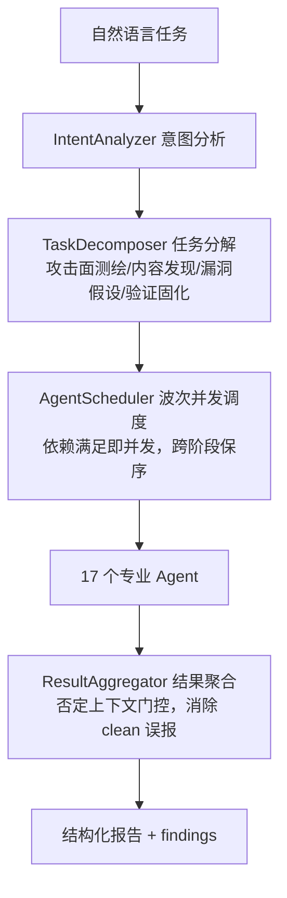

# Kali MCP — 多智能体渗透测试集群

<div align="center">


**确定性编排的 17-agent 渗透测试集群**

*一条自然语言指令 → 意图分析 → 任务分解 → 17 专业智能体波次并发调度 → 结构化报告，无需 LLM 密钥即可运行*

[中文](#中文) | [English](#english)

</div>

---

## 中文

### 定位

Kali MCP 是一个**确定性的多智能体渗透测试集群**：通过 MCP 协议或命令行，把「对某目标做渗透测试」这一自然语言任务，自动分解为侦察、扫描、利用、验证等子任务，调度 **1 个协调器 + 17 个专业智能体**并发执行真实工具，最终聚合出带严重性分级的结构化报告。

区别于依赖 LLM 实时推理的方案，本集群的**意图分析 → 任务分解 → 调度 → 聚合全链路是确定性算法**——无 LLM 密钥也能完整运行；LLM 密钥仅用于可选的深度推理增强。

### 架构



### 17 个专业智能体

| 分组 | 智能体 | 职责 |
|---|---|---|
| **信息收集** | `recon_agent` | 端口扫描 / 服务识别 / OS 指纹 / 拓扑侦察 |
| | `subdomain_agent` | 子域名枚举 / DNS 记录 / OSINT |
| | `web_recon_agent` | 目录枚举 / 技术栈识别 / WAF 检测 / CMS 指纹 |
| **漏洞发现** | `vuln_scanner_agent` | CVE / 模板化漏洞扫描 |
| | `web_vuln_agent` | SQLi / XSS / 命令注入等 Web 漏洞 |
| | `auth_agent` | 在线爆破 / 哈希破解 / 凭据喷洒 |
| | `network_vuln_agent` | SMB 枚举 / LLMNR 投毒 / MITM / 嗅探 |
| | `vuln_verifier_agent` | 候选漏洞验证 / PoC 构造 / 利用确认 |
| **利用** | `exploit_agent` | Metasploit / exploit 搜索 / 反弹 shell |
| | `privilege_agent` | Linux / Windows 提权向量分析 |
| | `lateral_agent` | DCSync / Kerberoast / AD 攻击 / 凭据重用 |
| **专门** | `code_analyze_agent` | 白盒源码树扫描 / 危险模式分析 |
| | `code_audit_agent` | SAST 静态分析 / 危险模式搜索 |
| | `crypto_agent` | CTF 密码学 / 编码识别 / 哈希破解 |
| | `forensics_agent` | 隐写 / 内存取证 / 文件系统取证 / 流量分析 |
| | `pwn_agent` | 二进制漏洞检查 / 逆向 / 反编译 |
| | `source_code_agent` | .git/.svn 泄露 / 备份扫描 / LFI 读源码 |

协调器 `CoordinatorAgent` 承接 `report_generator` 与无可用智能体的兜底任务。

### 核心特性

| 特性 | 说明 |
|---|---|
| **确定性编排** | 意图分析 / 分解 / 调度 / 聚合全链路算法化，无 LLM 密钥可用 |
| **波次并发调度** | 依赖满足即并发（`asyncio.gather`），跨阶段保序，冷跑无硬超时 |
| **自研 fastsec 引擎** | Go 重写，替代 25 个传统工具（nmap/sqlmap/nuclei/gobuster 等），单二进制全模式 |
| **知识库优先** | HackReport 经验库 + 263 万口令 / 667 万子域 / 6.3 万 payload 字典 |
| **实时可视化** | `agent_live.py` 事件驱动分色输出：意图 → 分解 → 调度 → 工具调用 → findings |
| **多后端执行** | local / ssh / docker 动态解析，本地与远程 Kali 无缝切换 |
| **Session 生命周期** | TTL 自动过期（4h），后台清理防内存泄漏 |

### 快速开始

#### 方式一：MCP（自然语言编排）

在支持 MCP 的客户端（Claude Desktop / Claude Code / Oh My Pi）配置：

```json
{
  "mcpServers": {
    "kali": {
      "command": "python",
      "args": ["mcp_server.py", "--tool-profile", "harness"],
      "env": {
        "KALI_MCP_FORCE_ENABLE_MODULES": "multi_agent",
        "K4_LEGACY_CLUSTER": "1"
      }
    }
  }
}
```

harness 档位暴露 13 个编排工具，核心三入口：

| 工具 | 用途 |
|---|---|
| `agent_run` | 自然语言任务 → 集群全流程（意图→分解→调度→聚合） |
| `agent_status` | 集群健康 / agent 列表 / 调度统计 |
| `kali_run` | 单工具兜底（任意注册工具名） |

另有 `start_task` / `run_surface_chain`（surface playbook 顺序执行）/ `board_snapshot` / `task_*` / `verify_finding` 等任务板与验证工具。

#### 方式二：CLI 实时可视化

```bash
# Windows
C:/Windows/py.exe -3 agent_live.py "对 http://localhost:8000/ 做 web 漏洞扫描：目录枚举、CMS识别、注入检测" --no-cache --timeout 300

# Linux / macOS
python3 agent_live.py "对 http://localhost:8000/ 做 web 漏洞扫描" --agents recon,web_vuln --no-cache
```

`agent_live.py` 逐行分色打印每个智能体的调度决策与工具调用结果，Windows Terminal 分屏即可获得类 tmux 的实时观察体验。

### 编排流水线

一条任务经过四阶段确定性编排（以 Web 目标为例）：

1. **攻击面测绘**：`nmap` / `masscan` / `subfinder` / `amass` → recon×2 + subdomain×2
2. **内容发现**：`gobuster` / `dirb` / `ffuf` / `feroxbuster` → web_recon×4
3. **漏洞假设**：`nuclei_web` / `nuclei` / `nikto` / `wpscan` → vuln_scanner×4
4. **验证固化**：`sqlmap` / `intelligent_xss_payloads` / 命令注入深挖 → web_vuln×4

surface playbook（`kali_mcp/core/playbooks/`）提供 `web_surface` / `api_surface` / `auth_surface` / `svc_surface` / `internal_lateral` / `stealth` / `chain` / `ai_guided` 八类标准打法，`run_surface_chain` 可顺序执行。

### 实测数据（2026-08-13 回归）

| 指标 | 结果 |
|---|---|
| 冷跑总耗时 | **174.76s**（< 300s 硬超时，波次并发 + `-c 50`） |
| 会话状态 | completed，17/17 任务完成，failed 0 |
| 调度成功率 | 16/16（**100%**） |
| findings 误报 | XSS clean 误报已修复，仅 1 个真实 SQL 注入 high finding |

### 后端执行

执行后端由 `resolve_backend()` 启动时动态解析：本地 PATH 有 Kali 工具走 local；检测到 SSH 配置走 `ssh` 后端（paramiko 免密）；容器环境走 docker。无需硬编码远程地址。

### 合规声明

本项目仅用于**已获书面授权**的渗透测试、CTF 竞赛、安全研究与防御性评估。使用前通过 `set_engagement_context` 声明授权范围；越权扫描、破坏性操作、未授权攻击严格禁止。

### License

MIT License — 详见 [LICENSE](LICENSE)。

---

## English

### Positioning

Kali MCP is a **deterministic multi-agent penetration testing cluster**: one natural-language instruction is decomposed into recon, scanning, exploitation, and verification subtasks, dispatched across **1 coordinator + 17 specialized agents** running real tools concurrently, and aggregated into a severity-graded structured report.

The full pipeline — intent analysis → task decomposition → scheduling → aggregation — is deterministic and runs **without any LLM API key**; LLM keys only enable optional deep-reasoning enhancement.

### Architecture

```
instruction → IntentAnalyzer → TaskDecomposer → AgentScheduler (wave-concurrent)
           → 17 agents → ResultAggregator (negation-gated) → structured report
```

### 17 Specialized Agents

- **Information gathering**: `recon_agent`, `subdomain_agent`, `web_recon_agent`
- **Vulnerability discovery**: `vuln_scanner_agent`, `web_vuln_agent`, `auth_agent`, `network_vuln_agent`, `vuln_verifier_agent`
- **Exploitation**: `exploit_agent`, `privilege_agent`, `lateral_agent`
- **Specialized**: `code_analyze_agent`, `code_audit_agent`, `crypto_agent`, `forensics_agent`, `pwn_agent`, `source_code_agent`

### Quick Start

```json
{
  "mcpServers": {
    "kali": {
      "command": "python",
      "args": ["mcp_server.py", "--tool-profile", "harness"],
      "env": {
        "KALI_MCP_FORCE_ENABLE_MODULES": "multi_agent",
        "K4_LEGACY_CLUSTER": "1"
      }
    }
  }
}
```

Three core MCP entries: `agent_run` (full pipeline), `agent_status` (cluster health), `kali_run` (single-tool fallback).

For real-time visualization:

```bash
python3 agent_live.py "web vuln scan on http://localhost:8000/" --no-cache
```

### Measured (2026-08-13 regression)

- Cold run: **174.76s** (under 300s cap, wave-concurrency + `-c 50`)
- Session: completed, 17/17 tasks, 0 failures
- Scheduling success: **100%** (16/16)
- Findings: 1 real high-severity SQL injection, XSS clean false-positive eliminated

### Disclaimer

For authorized security testing only. Users are responsible for complying with all applicable laws and regulations.

---

<div align="center">

**⭐ Star this repo if you find it useful!**

</div>
