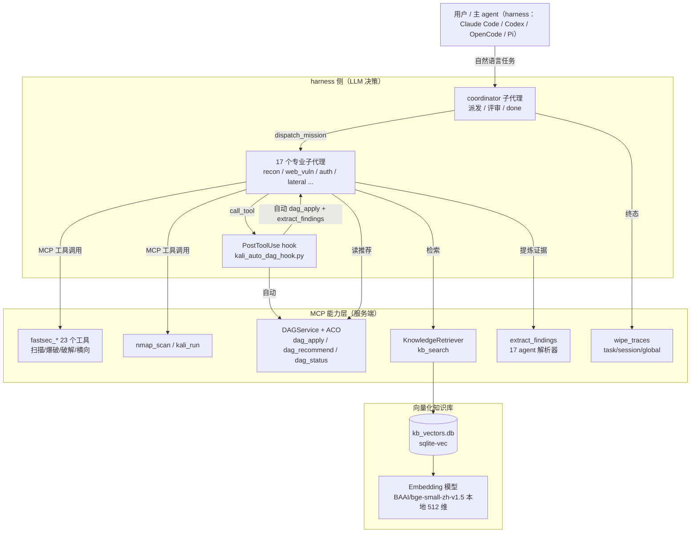
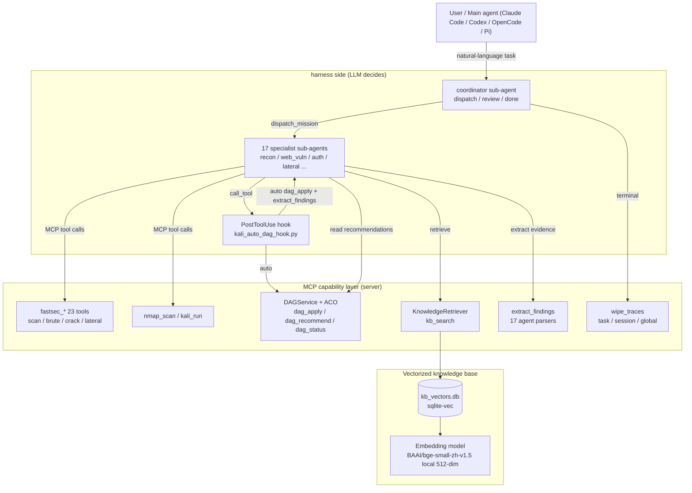

# Kali MCP — 能力层 MCP + 原生子代理渗透框架

<div align="center">


**能力层 MCP 服务器 + 18 个 harness 原生子代理 + hooks 自动集成：LLM 决策、MCP 执行、测试后自动清理**

*一条自然语言指令 → coordinator 子代理派发 → 17 个专业子代理调能力工具 → hooks 自动建攻击 DAG + 提炼证据 → ACO 推荐路径 → 测试完成自动清理痕迹*

[中文](#中文) | [English](#english) | [架构设计 ARCH_DESIGN](ARCH_DESIGN.md)

</div>

---

## 中文

### 定位

Kali MCP 是一套 **能力层 MCP + 原生子代理** 渗透测试框架：**LLM 在 harness 侧决策**（Claude Code / Codex / OpenCode / Pi 的主 agent + 18 个 markdown 子代理），**MCP 服务端只做能力执行**（fastsec 全能力工具 + 外部工具 + 攻击 DAG + 知识库 + 证据提炼 + 痕迹清理）。

- **18 个原生子代理**：`coordinator`（派发/评审/done，自动读 ACO 推荐）+ 17 个专业子代理（recon/web_vuln/auth/lateral 等），定义在 `.claude/agents/`、`AGENTS.md`、`opencode.json`、`skills/`。
- **hooks 自动集成**：子代理每次扫描工具调用后**自动** `dag_apply` 建节点 + `extract_findings` 提炼证据（LLM 透明，治"靠提示才调 DAG"的根因）。
- **攻击 DAG + 蚁群算法（ACO）**：发现沉淀为 DAG 节点，信息素沿攻击路径沉积，为后续行动提供**推荐**（仅推荐，不决策——LLM 可否决）。
- **测试后痕迹清理**：stealth 默认（XSS 无害 marker / SQLi 只读探测 / 无品牌 UA）+ `wipe_traces` 三粒度痕迹清理。

MCP 编排面（agent_run/agent_status）与 17-agent 集群初始化已**移除**——编排移入 harness 侧 coordinator 子代理；17 个 Python agent 类保留为 `extract_findings` 的解析器来源（`_parse_*_output` 确定性正则）。

### 架构



### 核心能力

| 能力 | 说明 | 代码模块 |
|---|---|---|
| **能力层 MCP（fastsec 23 工具）** | fastsec 单二进制 AI 原生扫描引擎的每个能力暴露为**独立 MCP 工具**（意图单一、参数精简）：`fastsec_port_scan`/`fastsec_dir_scan`/`fastsec_cms_scan`/`fastsec_sqli_scan`（`danger_level` 默认 0 只读）/`fastsec_xss_scan`（`xss_benign` 默认无害 marker）/`fastsec_brute`/`fastsec_osint`/`fastsec_fingerprint`/`fastsec_template_scan`/`fastsec_crack`/`fastsec_kerberos`/`fastsec_diff`/`fastsec_soceng`/`fastsec_orchestrate`/`fastsec_seq`/`fastsec_audit`/`fastsec_file`/`fastsec_user`/`fastsec_shell`/`fastsec_sam`/`fastsec_smb`/`fastsec_dump`（需显式授权）/`fastsec_kb` | `kali_mcp/mcp_tools/fastsec_tools.py` |
| **18 个原生子代理** | `coordinator`（派发/评审/done，自动读 ACO 推荐）+ 17 个专业子代理。每 agent 正文 5 节：角色/工具面/决策 JSON 协议/**自动集成约束**（扫描后必调 extract_findings + dag_apply）/协作协议 + 速率纪律。四 harness 全做：`.claude/agents/`（Claude Code）、`AGENTS.md`（Codex）、`opencode.json`（OpenCode）、`skills/`（Pi） | `scripts/gen_native_subagents.py` 生成 |
| **hooks 自动集成** | 子代理每次扫描工具调用后自动 `dag_apply(add_node attack_action)` 建节点 + `extract_findings` 提炼证据，返回 `[AUTO-DAG]` 附加块（LLM 透明）。Claude Code 已配 PostToolUse；其余 harness 接线见 `scripts/hooks/README.md` | `scripts/kali_auto_dag_hook.py`、`.claude/settings.json` |
| **证据提炼 extract_findings** | 复用 17 个 Python agent 的确定性正则解析器（`_parse_*_output`），工具输出 → 结构化 Finding（type/severity/title/evidence/confidence）。**evidence 只来自真实输出的正则匹配，禁止 LLM 自编** | `kali_mcp/mcp_tools/extract_findings_tools.py` |
| **攻击 DAG + 蚁群算法（ACO）** | 发现（observation/hypothesis/attack_action/finding/mission）作为 DAG 节点，边承载信息素 τ，`P(e) = τ^α·η^β` 归一化后给出候选边评分。**ACO 只做路径推荐，LLM 可以采纳、引用或否决** | `kali_mcp/reasoning/attack_dag.py`、`kali_mcp/reasoning/aco.py`、`kali_mcp/mcp_tools/kg_dag_tools.py` |
| **向量化知识库** | 本地 embedding（bge-small-zh-v1.5，512 维，随仓库提供）+ sqlite-vec 单文件向量库 + BM25 关键词召回，RRF 融合。`kb_search` 独立构造检索器（主线程预热防 Windows 卡死） | `kali_mcp/reasoning/knowledge_retriever.py`、`scripts/build_kb_index.py` |
| **痕迹清理 wipe_traces** | 三粒度：`task`（删 workspace/tasks/<id>/ 整目录，chain REPORT 终态默认自动触发）/ `session`（删 DAG 会话 + d01_session.json）/ `global`（清运行时状态，永不自动）。task_id 白名单校验防路径穿越；知识库/模型/字典永不删；目标侧清除只出命令模板 | `kali_mcp/core/trace_wipe.py`、`kali_mcp/mcp_tools/wipe_tools.py` |
| **Stealth 纪律** | XSS 无害 marker 单请求（`-xss-benign`，不向生产打 alert(1)）；SQLi 默认 `-danger-level 0` 只读探测（写操作需显式授权）；无品牌 UA；速率纪律 `RATE_DISCIPLINE` 注入子代理定义 | `tools/fastsec/internal/injector/`、`kali_mcp/core/playbooks/stealth.py` |
| **执行后端自适应** | 启动时 `resolve_backend()` 自动检测：本地 subprocess（默认）、SSH 远程主机、Docker 容器，无需改代码 | `kali_mcp/core/backend.py` |

### 18 个原生子代理（harness 侧，四 harness 全做）

每个子代理是 **harness 原生 markdown 定义**（非 MCP 服务端进程）：正文 5 节 = 角色/工具面/决策 JSON 协议/**自动集成约束**（扫描后必调 `extract_findings` + `dag_apply`，LLM 透明）/协作协议（`dag_recommend` 仅参考，ACO 不决策）+ 速率纪律（`RATE_DISCIPLINE`）。`coordinator` 负责派发/评审/done；17 个专业子代理各自调能力工具。

**交付文件**：`.claude/agents/*.md`（Claude Code）、`AGENTS.md`（Codex，`## Role:` 分节）、`opencode.json`（OpenCode，`"agent"` 节）、`skills/kali-*.md`（Pi）。生成器：`scripts/gen_native_subagents.py`。

| 分组 | 智能体 | 职责 |
|---|---|---|
| **信息收集** | `recon_agent` | 端口扫描 / 服务识别 / OS 指纹 / 拓扑侦察 |
| | `subdomain_agent` | 子域名枚举 / DNS 记录 / OSINT |
| | `web_recon_agent` | 目录枚举 / 技术栈识别 / WAF 检测 / CMS 指纹 |
| **漏洞发现** | `vuln_scanner_agent` | CVE / 模板化漏洞扫描 |
| | `web_vuln_agent` | SQLi / XSS / 命令注入等 Web 漏洞 |
| | `auth_agent` | 在线爆破 / 哈希破解 / 凭据喷洒 |
| | `network_vuln_agent` | SMB 枚举 / LLMNR 投毒 / MITM / 嗅探 |
| | `vuln_verifier_agent` | 候选漏洞验证 / PoC 构造 / 利用确认 |
| **利用** | `exploit_agent` | Metasploit / exploit 搜索 / 反弹 shell |
| | `privilege_agent` | Linux / Windows 提权向量分析 |
| | `lateral_agent` | DCSync / Kerberoast / AD 攻击 / 凭据重用 |
| **专门** | `code_analyze_agent` | 白盒源码树扫描 / 危险模式分析 |
| | `code_audit_agent` | SAST 静态分析 / 危险模式搜索 |
| | `crypto_agent` | CTF 密码学 / 编码识别 / 哈希破解 |
| | `forensics_agent` | 隐写 / 内存取证 / 文件系统取证 / 流量分析 |
| | `pwn_agent` | 二进制漏洞检查 / 逆向 / 反编译 |
| | `source_code_agent` | .git/.svn 泄露 / 备份扫描 / LFI 读源码 |

### 工具面（MCP surface）

MCP 表面已从 192 个工具收敛为 **keep-set（约 50 个原生注册）+ `kali_run` 元回退**：归档模块文件保留但**不再注册**，其命令仍可经 `kali_mcp.core.tool_registry` 构建，通过 `kali_run` 按名调用（keep-set 或归档、registry key 或别名均可）。

| 类别 | 工具 |
|---|---|
| **KG/DAG 能力** | `dag_apply`（DAGService.apply 写命令：add_node/add_edge/update_node/deposit/deposit_path/evaporate，串行落库）、`dag_recommend`（ACO 候选边 P(e) 评分，只推荐不决策）、`dag_status`（攻击 DAG 全局状态：节点/边、信息素 top 路径、前沿候选边）、`kb_search`（语义+关键词混合检索知识库） |
| **证据提炼** | `extract_findings`（复用 17 个 Python agent 的确定性正则解析器，工具输出 → 结构化 Finding，LLM 透明） |
| **痕迹清理** | `wipe_traces`（三粒度：task 删 workspace/tasks/<id>/ 整目录 / session 删 DAG 会话+d01_session.json / global 清运行时状态；目标侧清除只出命令模板） |
| **任务板** | `start_task`、`task_status`、`run_surface_chain`、`verify_finding`、`task_create`、`task_claim`、`task_complete`、`task_renew`、`task_list`、`board_snapshot` |
| **fastsec 扫描** | **23 个独立能力工具**（fastsec 二进制全模式）：`fastsec_port_scan`、`fastsec_dir_scan`、`fastsec_cms_scan`、`fastsec_sqli_scan`（`danger_level` 默认 0 只读）、`fastsec_xss_scan`（`xss_benign` 默认无害 marker）、`fastsec_brute`、`fastsec_osint`、`fastsec_fingerprint`、`fastsec_template_scan`、`fastsec_crack`、`fastsec_kerberos`、`fastsec_diff`、`fastsec_soceng`（社工字典）、`fastsec_orchestrate`（编排扫描）、`fastsec_seq`（状态化序列）、`fastsec_audit`（静态审计）、`fastsec_file`（取证分析）、`fastsec_user`（用户名搜索）、`fastsec_shell`（payload 生成）、`fastsec_sam`（SAM 提取）、`fastsec_smb`（SMB 横向）、`fastsec_dump`（数据提取，需 `danger_level>=1`）、`fastsec_kb`（本地知识库）；`fastsec_scan`（旧 kali_run 回退名） |
| **端口/服务** | `nmap_scan`、`rustscan_scan`、`naabu_scan`、`comprehensive_recon`、`server_health` |
| **口令/域渗透** | `john_crack`、`hashcat_crack`、`kerbrute_attack`、`GetNPUsers_scan`、`GetUserSPNs_scan`、`nxc_attack`、`evil_winrm_attack`、`secretsdump_scan`、`psexec_attack`、`smbexec_attack` |
| **利用** | `metasploit_run`、`quick_pwn_check` |
| **会话/工作流** | `start_attack_session`、`list_attack_sessions`、`wf_init`、`wf_transition`、`wf_record_result`、`wf_record_issue`、`wf_status`、`wf_pack_turn` |
| **异步扫描** | `scan_start`、`scan_collect`、`scan_wait`、`scan_jobs` |
| **元回退** | `kali_run`（任意 registry 工具按名执行） |

> 预定义 playbook（`run_playbook` / `run_surface_chain`）已**移出主路径**（战术内容向量化进 KB 作参考），仅设置 `K4_LEGACY_PLAYBOOKS=1` 时作为过渡期兼容注册。

### fastsec 自研扫描引擎

`tools/fastsec/` 是 Go 单二进制引擎（含 `data/` 内置字典：`dns/` 子域字典 63MB、`brute/` 口令字典 40MB 含 263 万 top 口令、`knowledge/` 经验库 2.5MB），核心能力：

| 能力 | 参数（MCP 工具） |
|---|---|
| 目录枚举 | `fastsec_dir_scan`（`-dir <url>` / `-w <wordlist>`） |
| CMS 识别 | `fastsec_cms_scan`（`-cms <url>`） |
| SQL 注入检测 | `fastsec_sqli_scan`（`-inject <param,...>`，`danger_level` 0=只读默认） |
| XSS 反射检测 | `fastsec_xss_scan`（`-xss <param,...>`，`xss_benign` 默认无害 marker） |
| 登录爆破 | `fastsec_brute`（`-brute <host>`、`-service http-form\|tcp-banner`、`-U/-P` 字典、`-form-*` 表单配置） |
| 口令字典生成 | `-soceng <name>`（社工字典） |
| Kerberos | `fastsec_kerberos`（`-kerberos <kdc>`、`-domain`、`-kusers`（AS-REP / Kerberoast）、`-kpass`） |
| 服务指纹 | `fastsec_fingerprint`（`-fingerprint <host>` / `-fp-ports`） |
| 模板扫描 | `fastsec_template_scan`（`-t <file>` / `-d <dir>`，nuclei 风格模板） |
| 行为差异 | `fastsec_diff`（`-diff <params>`） |
| OSINT | `fastsec_osint`（`-osint <domain>`） |
| 哈希破解 | `fastsec_crack`（`-crack md5:<hash>` / `-crack-wordlist`） |
| 端口扫描 | `fastsec_port_scan`（`-scan <target>` / `-scan-range`） |
| 社工字典 | `fastsec_soceng`（`-soceng <name>`，本地生成） |
| 编排扫描 | `fastsec_orchestrate`（`-orchestrate <target>`） |
| 状态化序列 | `fastsec_seq`（`-seq <yaml>`） |
| 静态审计 | `fastsec_audit`（`-audit <path>`，SAST） |
| 取证分析 | `fastsec_file`（`-file <path>`，替代 binwalk） |
| 用户名搜索 | `fastsec_user`（`-user <name>`，替代 sherlock） |
| 反连 payload | `fastsec_shell`（`-shell <lang>` / `-s-host` / `-s-port` / `-s-enc`，只生成不执行） |
| SAM 提取 | `fastsec_sam`（`-sam <hive>` / `-system <hive>`） |
| SMB 横向 | `fastsec_smb`（`-smb <host>` / `-smb-cmd` / `-smb-user` / `-smb-pass`） |
| 数据提取 | `fastsec_dump`（`-dump <url>` / `-dump-param`，需 `danger_level>=1` 显式授权） |
| 知识库查询 | `fastsec_kb`（`-kb <query>`，内置 knowledge.json，非扫描） |

### 快速开始

#### 1. 环境准备

```bash
# Python 3.10+
python -m venv .venv
# Windows: .venv\Scripts\activate   |   Linux/macOS: source .venv/bin/activate
pip install -r requirements.txt
```

- **embedding 模型已随仓库提供**：`data/models/models--BAAI--bge-small-zh-v1.5/`（512 维，完全离线可跑，无需联网下载）。
- **知识库索引已随仓库提供**：`data/kb_vectors.db`（sqlite-vec 单文件）。
- fastsec 引擎需要 Go 工具链时自行 `cd tools/fastsec && go build -o fastsec ./cmd/fastsec`（或直接用仓库内已构建产物；扫描也可完全走 `nmap_scan` 等 keep-set 工具，不强制 fastsec）。

#### 2. MCP 接入（Claude Code / Codex / OpenCode / Pi）—— 原生子代理为主路径

Kali MCP 是标准 **stdio MCP 服务器**。当前架构 = **能力层 MCP + 18 个原生 markdown 子代理 + hooks 自动集成**：

- **能力层 MCP**（服务端）：`python mcp_server.py --tool-profile harness` 暴露纯能力工具——扫描/枚举（fastsec 全能力 23 个独立工具 + nmap_scan/kali_run 等）+ **DAG/ACO 读写与观测**（`dag_apply`/`dag_recommend`/`dag_status`）+ **知识库检索**（`kb_search`）+ **证据提炼**（`extract_findings`，复用 17 个 Python agent 的确定性解析器）+ 任务板 + 痕迹清理（`wipe_traces`）。MCP 编排面（两个 pure-orchestration 工具）与 17-agent 集群初始化已**移除**——编排移入 harness 侧 coordinator 子代理。
- **18 个原生子代理**（仓库已生成，见下表）：`coordinator`（派发/评审/done，自动读 DAG/ACO 推荐）+ 17 个专业子代理（recon/web_vuln/auth 等）。每个正文含角色目标、工具面、决策 JSON 协议、**自动集成约束**（扫描后必调 extract_findings + dag_apply，LLM 透明）、协作协议（dag_status/dag_recommend 参考，ACO 只推荐不决策）与速率纪律。
- **hooks 自动触发**：`.claude/settings.json` 的 PostToolUse hook（其余 harness 见 `scripts/hooks/README.md`）在子代理每次扫描工具调用后**自动** `dag_apply` 建节点 + `extract_findings` 提炼——治"靠提示才调 DAG"的根因。

| harness | 子代理文件 | hook 落点 |
|---|---|---|
| Claude Code | `.claude/agents/*.md` ×18 | `.claude/settings.json`（已配） |
| Codex | `AGENTS.md`（`## Role:` ×18） | `~/.codex/config.toml`（示例见 `scripts/hooks/README.md`） |
| OpenCode | `opencode.json` 的 `"agent"` 节 ×18 | `plugin`/`tool.execute.after`（示例见 hooks README） |
| Pi（omp） | `skills/kali-*.md` ×18 | omp hook 等价机制（示例见 hooks README） |

接入后直接说：

```
对 http://target/ 做一次完整渗透：先侦察，再扫 Web 漏洞，验证后给出利用建议
```

主 agent 发起 → `coordinator` 子代理派发 → 专业子代理调能力工具 → hook 自动建 DAG/提炼证据 → coordinator 读 `dag_recommend` 决定下一步。

##### Claude Code

项目级配置 `.mcp.json`（MCP 能力层）：

```json
{
  "mcpServers": {
    "kali": {
      "command": "python",
      "args": ["mcp_server.py", "--tool-profile", "harness"],
      "cwd": ".",
      "env": { "KALI_MCP_TOOL_PROFILE": "harness" }
    }
  }
}
```

子代理自动加载：`.claude/agents/`（18 个已生成）；hooks 自动集成：`.claude/settings.json`（已配 PostToolUse → `scripts/kali_auto_dag_hook.py`）。

##### Codex（OpenAI Codex CLI）

用户级配置 `~/.codex/config.toml`：

```toml
[mcp_servers.kali]
command = "python"
args = ["mcp_server.py", "--tool-profile", "harness"]
env = { KALI_MCP_TOOL_PROFILE = "harness" }
```

子代理定义在仓库根 `AGENTS.md`（`## Role:` 分节 ×18）；tool-use 后 hook 见 `scripts/hooks/README.md`。

##### OpenCode

项目级 `opencode.json`（本仓库已生成：18 个 `"agent"` 定义 + `"mcp.kali"` 并存）：

```json
{
  "$schema": "https://opencode.ai/config.json",
  "mcp": {
    "kali": {
      "type": "local",
      "command": ["python", "mcp_server.py", "--tool-profile", "harness"],
      "environment": { "KALI_MCP_TOOL_PROFILE": "harness" },
      "enabled": true
    }
  },
  "agent": { }
}
```

`"agent"` 节的 18 个定义已生成在仓库根 `opencode.json`；hook（`tool.execute.after`）示例见 `scripts/hooks/README.md`。

##### Pi / Oh My Pi

Pi（omp）读取仓库根目录标准 `.mcp.json`（与 Claude Code 同一格式）：

```json
{
  "mcpServers": {
    "kali": {
      "command": "python",
      "args": ["mcp_server.py", "--tool-profile", "harness"],
      "cwd": ".",
      "env": { "KALI_MCP_TOOL_PROFILE": "harness" }
    }
  }
}
```

子代理定义在 `skills/kali-*.md` ×18（frontmatter name/description + 正文 5 节）；主 agent 用 task 调度 coordinator 或直接派专业子代理。hook 等价机制示例见 `scripts/hooks/README.md`。

> 注意：`command` 里把 `python` 换成你机器上的解释器绝对路径（Windows 常见 `C:\Windows\py.exe -3` 或 `.venv\Scripts\python.exe`）；`cwd` 指向仓库根目录，保证 `mcp_server.py`、`data/`、`tools/fastsec/` 相对路径正确。

#### 3. CLI 实时可视化（不接 harness）

```bash
# Windows
C:/Windows/py.exe -3 agent_live.py "对 http://localhost:8000/ 做 web 漏洞扫描：目录枚举、CMS识别、注入检测" --no-cache --timeout 300

# Linux / macOS
python3 agent_live.py "对 http://localhost:8000/ 做 web 漏洞扫描" --agents recon,web_vuln --no-cache
```

`agent_live.py` 是纯展示层：逐行分色打印 orchestrator 的规划/派活决策、每个子 agent 的 LLM 决策与工具调用结果、findings 与总结推送，Windows Terminal 分屏即可获得类 tmux 的实时观察体验。`--agents` 可按 agent_id 精确或前缀匹配（如 `recon` 匹配 `recon_agent`）。

#### 4. SSE 远程模式

```bash
python mcp_server.py --transport sse --host 0.0.0.0 --port 8765 --tool-profile harness
# SSE 端点: http://<your-ip>:8765/sse
```

供远程客户端 / 多机部署接入（OpenCode 等支持 remote MCP 的 harness 可用 `"type": "remote", "url": "http://<ip>:8765/sse"` 连接）。

### LLM Provider 配置

决策循环由 `kali_mcp/core/llm_brain.py` 的 `LLMBrain` 驱动，双 provider 支持，全部走环境变量：

| 环境变量 | 说明 |
|---|---|
| `LLM_PROVIDER` | 显式指定 provider：`anthropic`（或 `claude`）/ `openai`（或 `codex`）。不设时自动探测：存在 `OPENAI_API_KEY` 走 OpenAI，否则走 Claude |
| `ANTHROPIC_API_KEY`（或 `ANTHROPIC_AUTH_TOKEN`） | Claude provider 密钥 |
| `ANTHROPIC_MODEL` | Claude 模型名 |
| `ANTHROPIC_BASE_URL` | 自定义 Claude 端点（自动补 `/v1` 后缀，兼容代理/网关） |
| `OPENAI_API_KEY`（或 `OPENAI_AUTH_TOKEN`） | OpenAI provider 密钥 |
| `OPENAI_MODEL` | OpenAI 模型名 |
| `OPENAI_BASE_URL` | 自定义 OpenAI 端点（兼容代理 / 兼容网关） |

**无任何 LLM key**：`LLMBrain.available = False`，子 agent 自动回退 legacy 确定性路径（`kali_mcp/agents/*/_execute_task_impl_legacy`），集群照常运行、不空转；但 LLM 自主决策（动态规划、语义检索、ACO 引导、联网情报）不可用——**那不是本项目的常态模式**。

联网搜索可选配置：`WEB_SEARCH_BACKEND=ddg|tavily`（默认 `ddg`）；切 `tavily` 需 `TAVILY_API_KEY`。

### 知识库与 Embedding

- **Embedding 模型**：`BAAI/bge-small-zh-v1.5`（512 维，中文友好），权重随仓库提供于 `data/models/models--BAAI--bge-small-zh-v1.5/`（HuggingFace cache 结构），完全离线加载（`snapshot_download(local_files_only=True)`）。
- **向量库**：`data/kb_vectors.db`（sqlite-vec 单文件，随仓库提供），失败自动降级 numpy+JSON。
- **召回**：向量 top-k + BM25 关键词 + **RRF 融合**；中英混合 tokenizer（ASCII 词 + CJK 单字）。
- **数据源**（`scripts/kb_sources.yaml`）：

| source | 内容 | parser |
|---|---|---|
| `credentials_guide` | `data/wordlists/` 渗透字典与默认账号库 | markdown |
| `runbook_internal` | `doc/runbook-internal.md` 内部运行约定 | markdown |
| `capability_plan` | `doc/能力升级总计划.md` 演进方向 | markdown |
| `writeups` | `docs/writeups/*.md` 实战 writeup | markdown |
| `plans` | `docs/plans/*.md` 设计/计划文档 | markdown |
| `recipes` | `tools_recipes/*.yaml` 工具配方 | yaml |
| `playbooks` | playbook docstring 摘录 | playbook_docstring |
| `attack_chains` | `knowledge_graph.py` AttackChain 结构化条目（25 条） | attack_chain |

重建 / 增量更新知识库索引（幂等：按 `content_hash` 跳过未变文件）：

```bash
python scripts/build_kb_index.py
```

### 执行后端

`mcp_server.py` 启动时经 `kali_mcp/core/backend.resolve_backend()` 自动检测执行后端，无需改代码：

| 后端 | 说明 |
|---|---|
| `local`（默认） | subprocess 直接调用本机工具（Kali / 自建环境） |
| `ssh` | 通过 SSH 在远程 Kali 主机执行（配置远程主机信息后自动启用） |
| `docker` | 在容器内执行 |

### 环境变量总表

| 环境变量 | 默认 | 说明 |
|---|---|---|
| `KALI_MCP_TOOL_PROFILE` | `harness` | 工具档位：`strict` / `compliance` / `full` / `harness` |
| `KALI_MCP_FORCE_ENABLE_MODULES` | — | 强制启用模块（逗号分隔） |
| `KALI_MCP_FORCE_DISABLE_MODULES` | — | 强制禁用模块（逗号分隔） |
| `K4_LEGACY_PLAYBOOKS` | — | `1` 时注册 legacy playbook 工具（过渡期兼容） |
| `KALI_MCP_WORKSPACE` | `workspace/` | 任务工作区（扫描产物/证据/报告落盘） |
| `KALI_MCP_AUTO_WIPE` | `1` | chain REPORT 终态自动清理 task 痕迹；`0` 关闭 |
| `KALI_MCP_KEEP_REPORT` | 未设 | `1` 时 task 级清理保留 `report/` 子目录 |
| `KALI_MCP_ENGAGEMENT_JSON` / `KALI_MCP_ENGAGEMENT_FILE` | — | 授权范围声明（目标 scope），工具执行前校验 |
| `KALI_MCP_REQUIRE_ENGAGEMENT_CONTEXT` | — | `1` 时强制要求授权上下文 |
| `LLM_PROVIDER` | 自动探测 | `anthropic` / `openai` |
| `ANTHROPIC_API_KEY` / `ANTHROPIC_MODEL` / `ANTHROPIC_BASE_URL` | — | Claude provider |
| `OPENAI_API_KEY` / `OPENAI_MODEL` / `OPENAI_BASE_URL` | — | OpenAI provider |
| `WEB_SEARCH_BACKEND` | `ddg` | 搜索后端：`ddg` / `tavily` |
| `TAVILY_API_KEY` | — | tavily 后端密钥 |

> `K4_LEGACY_CLUSTER` 已移除（17-agent 集群初始化不再存在；编排移入 harness 侧 coordinator 子代理）。

### 目录结构

```
Kali-Security-MCP/
├── mcp_server.py            # MCP 入口（FastMCP；工具按模块注册 + K1 收敛裁剪）
├── agent_live.py            # CLI 实时可视化（逐行分色打印 orchestrator/agent 决策）
├── kali_mcp/
│   ├── core/                # trace_wipe / task_workspace / playbooks(stealth/chain) ...
│   ├── agents/              # 17 个 Python agent（解析器来源，extract_findings 复用 _parse_*_output）
│   ├── reasoning/           # attack_dag / aco / knowledge_retriever（服务端单点，不重写）
│   ├── mcp_tools/           # fastsec_tools / kg_dag_tools / extract_findings_tools /
│   │                        # wipe_tools / harness_tools / meta_tools / board_tools ...
│   └── security/            # tool_profile / engagement（授权范围）
├── tools/fastsec/           # 自研 Go 扫描引擎 + 内置字典（dns/brute/knowledge）
├── data/
│   ├── kb_vectors.db        # 向量化知识库索引（sqlite-vec，随仓库提供）
│   ├── models/              # embedding 模型权重（bge-small-zh-v1.5，随仓库提供）
│   └── wordlists/           # 口令/默认账号指南（KB 源）
├── scripts/
│   ├── build_kb_index.py    # 知识库索引构建（幂等增量）
│   ├── kb_sources.yaml      # KB 数据源声明
│   ├── gen_native_subagents.py  # 18 子代理生成器（四 harness）
│   ├── kali_auto_dag_hook.py   # 自动集成 hook（PostToolUse）
│   └── hooks/README.md      # 四 harness hook 接线指南
├── .claude/agents/*.md      # 18 原生子代理（Claude Code）
├── AGENTS.md                # Codex 子代理定义
├── opencode.json            # OpenCode 子代理定义 + mcp.kali
├── skills/kali-*.md         # Pi 子代理定义
├── docs/                    # writeups / plans
├── doc/                     # runbook-internal / 能力升级总计划
├── tests/                   # pytest 全量测试（含 KB 索引 / DAG / ACO / e2e）
├── workspace/               # 任务工作区（运行产物）
├── .mcp.json                # MCP 部署配置实例（Claude Code / Pi 等）
├── CLAUDE.md                # Claude Code 仓库指引
└── requirements.txt
```

### 测试

```bash
pytest                    # 全量
pytest -x                 # 首个失败即停
pytest --cov=kali_mcp     # 覆盖率
pytest -k "kb or dag or aco or orchestrator or llm"   # 关键子系统
```

### 合规声明

本项目仅用于**已获书面授权**的渗透测试、CTF 竞赛、安全研究与防御性评估。使用前通过 `set_engagement_context`（或 `KALI_MCP_ENGAGEMENT_JSON/FILE`）声明授权范围；越权扫描、破坏性操作、未授权攻击严格禁止。使用者须自行确保对目标的所有操作均符合适用法律法规。

**Stealth & Rate Discipline**：XSS 等检测默认无害 marker 单请求验证（`-xss-benign`，不向生产打 alert(1) 集）；SQLi 默认 `-danger-level 0` 只读探测（写操作需显式 `-danger-level 2` 授权）；所有外发请求 UA 为真实浏览器随机 UA（品牌 UA 已移除）；速率纪律见 `RATE_DISCIPLINE`（`kali_mcp/core/playbooks/stealth.py`），机械兜底 = fastsec 内建节流（-c 20 / delay 300-800ms）。

**痕迹清理**：`wipe_traces` 工具按粒度自动清理本机痕迹——`task`（删 workspace/tasks/<id>/ 整目录，chain REPORT 终态默认自动触发，`KALI_MCP_AUTO_WIPE=0` 关闭）、`session`（删 DAG 会话 + d01_session.json）、`global`（清运行时状态，**永不自动**，需显式 `scope="global"`）。删除**不可恢复**；知识库/模型/字典（kb_vectors.db/models/wordlists 等）永不进清理清单。目标侧清除只输出命令模板（`target_manual_cleanup`），不自动执行——目标侧删除属操作者授权动作。

### License

MIT License — 详见 [LICENSE](LICENSE)。

---

## English

### Positioning

Kali MCP is a **capability-layer MCP server + native-subagent penetration framework**:  
the **LLM decides in the harness** (main agent + 18 markdown sub-agents in Claude Code / Codex / OpenCode / Pi), and the **MCP server only executes capabilities** (23 fastsec tools + external tools + attack DAG + knowledge base + evidence extraction + trace wiping).

- **18 native sub-agents**: `coordinator` (dispatch/review/done, auto-reads ACO recommendations) + 17 specialist sub-agents (recon/web_vuln/auth/lateral/...), defined in `.claude/agents/`, `AGENTS.md`, `opencode.json`, `skills/`.
- **Hook auto-integration**: after every scan tool call, a PostToolUse hook automatically runs `dag_apply(add_node)` + `extract_findings` (LLM-transparent — no prompt nagging required).
- **Attack DAG + ACO**: discoveries become DAG nodes; pheromone deposits along attack paths and *recommends* — never decides — next moves (the LLM may override).
- **Post-test trace cleanup**: stealth by default (benign XSS marker / read-only SQLi probing / no branded UA) + `wipe_traces` three-scope cleanup.

The MCP orchestration surface (the two pure-orchestration tools) and the 17-agent cluster init were **removed** — orchestration now lives in the harness-side `coordinator` subagent; the 17 Python agent classes remain as the parser source for `extract_findings` (`_parse_*_output` deterministic regexes).

### Quick Start

```bash
python -m venv .venv && source .venv/bin/activate   # or .venv\Scripts\activate on Windows
pip install -r requirements.txt
```

The embedding model (`BAAI/bge-small-zh-v1.5`, 512-dim) ships in `data/models/` and the vectorized KB index (`data/kb_vectors.db`) ships in `data/` — fully offline, no download needed.

**Connect from any MCP-capable harness** (all use the same stdio server `python mcp_server.py --tool-profile harness`):

- **Claude Code / Pi**: `.mcp.json` at project root —

```json
{
  "mcpServers": {
    "kali": {
      "command": "python",
      "args": ["mcp_server.py", "--tool-profile", "harness"],
      "env": { "KALI_MCP_TOOL_PROFILE": "harness" }
    }
  }
}
```

Sub-agents auto-load from `.claude/agents/` (Claude Code) / `skills/` (Pi); hook auto-integration via `.claude/settings.json` (Claude Code) — see `scripts/hooks/README.md` for all harnesses.

- **Codex** (`~/.codex/config.toml`):

```toml
[mcp_servers.kali]
command = "python"
args = ["mcp_server.py", "--tool-profile", "harness"]
env = { KALI_MCP_TOOL_PROFILE = "harness" }
```

Role definitions live in the repo-root `AGENTS.md` (`## Role:` ×18).

- **OpenCode** (`opencode.json`, shipped with 18 `"agent"` definitions + `mcp.kali`):

```json
{
  "$schema": "https://opencode.ai/config.json",
  "mcp": {
    "kali": {
      "type": "local",
      "command": ["python", "mcp_server.py", "--tool-profile", "harness"],
      "environment": { "KALI_MCP_TOOL_PROFILE": "harness" },
      "enabled": true
    }
  }
}
```

**CLI live view** (no harness needed):

```bash
python3 agent_live.py "scan http://localhost:8000/ for web vulnerabilities" --no-cache
```

**LLM provider env vars**: `LLM_PROVIDER=anthropic|openai` (auto-detected from keys), `ANTHROPIC_API_KEY/MODEL/BASE_URL`, `OPENAI_API_KEY/MODEL/BASE_URL`.

**KB rebuild**: `python scripts/build_kb_index.py` (idempotent, content-hash incremental).

### Architecture



### Core Capabilities

| Capability | Description | Module |
|---|---|---|
| **Capability-layer MCP (23 fastsec tools)** | Each fastsec mode is a standalone MCP tool (single intent, slim params): `fastsec_port_scan`/`fastsec_dir_scan`/`fastsec_cms_scan`/`fastsec_sqli_scan` (`danger_level` 0=read-only default)/`fastsec_xss_scan` (`xss_benign` benign-marker default)/`fastsec_brute`/`fastsec_osint`/`fastsec_fingerprint`/`fastsec_template_scan`/`fastsec_crack`/`fastsec_kerberos`/`fastsec_diff`/`fastsec_soceng`/`fastsec_orchestrate`/`fastsec_seq`/`fastsec_audit`/`fastsec_file`/`fastsec_user`/`fastsec_shell`/`fastsec_sam`/`fastsec_smb`/`fastsec_dump` (explicit auth required)/`fastsec_kb` | `kali_mcp/mcp_tools/fastsec_tools.py` |
| **18 native sub-agents** | `coordinator` + 17 specialists, 5-section bodies (role / tool surface / decision JSON protocol / **auto-integration rules** / collaboration) + rate discipline; generated for 4 harnesses | `scripts/gen_native_subagents.py` |
| **Hook auto-integration** | PostToolUse hook auto-runs `dag_apply(add_node)` + `extract_findings` after every scan tool call, returns `[AUTO-DAG]` block (LLM-transparent) | `scripts/kali_auto_dag_hook.py` |
| **extract_findings** | Deterministic regex parsers (`_parse_*_output`) from the 17 Python agents turn raw tool output into structured Findings. **Evidence never fabricated by the LLM** | `kali_mcp/mcp_tools/extract_findings_tools.py` |
| **Attack DAG + ACO** | Discoveries become DAG nodes; edges carry pheromone τ; `P(e) = τ^α·η^β` scores candidate edges. **ACO only recommends — the LLM decides** | `kali_mcp/reasoning/attack_dag.py`, `kali_mcp/reasoning/aco.py`, `kali_mcp/mcp_tools/kg_dag_tools.py` |
| **Vectorized knowledge base** | Local `BAAI/bge-small-zh-v1.5` embeddings (shipped) + `sqlite-vec` single-file store (`data/kb_vectors.db`, shipped) + BM25, RRF-fused; idempotent incremental index builds | `kali_mcp/reasoning/knowledge_retriever.py`, `scripts/build_kb_index.py` |
| **Trace wiping** | `wipe_traces` three scopes: task (whole workspace dir, auto at chain REPORT terminal) / session (DAG session + d01_session.json) / global (runtime state, never auto). task_id whitelist blocks path traversal; KB/models/wordlists never deleted; target cleanup = templates only | `kali_mcp/core/trace_wipe.py`, `kali_mcp/mcp_tools/wipe_tools.py` |
| **Stealth discipline** | XSS benign-marker single request (`-xss-benign`); SQLi default `-danger-level 0` read-only (writes need explicit auth); no branded UA; rate discipline `RATE_DISCIPLINE` injected into sub-agent definitions | `tools/fastsec/internal/injector/`, `kali_mcp/core/playbooks/stealth.py` |
| **Adaptive execution backend** | Auto-detected at startup: local subprocess (default) / SSH / Docker | `kali_mcp/core/backend.py` |

### The 18 Native Sub-agents

| Group | Agents |
|---|---|
| **Information gathering** | `recon_agent`, `subdomain_agent`, `web_recon_agent` |
| **Vulnerability discovery** | `vuln_scanner_agent`, `web_vuln_agent`, `auth_agent`, `network_vuln_agent`, `vuln_verifier_agent` |
| **Exploitation** | `exploit_agent`, `privilege_agent`, `lateral_agent` |
| **Specialized** | `code_analyze_agent`, `code_audit_agent`, `crypto_agent`, `forensics_agent`, `pwn_agent`, `source_code_agent` |
| **Orchestration** | `coordinator` (dispatch/review/done, auto-reads ACO recommendations) |

### MCP Tool Surface (converged keep-set)

| Category | Tools |
|---|---|
| **KG/DAG capability** | `dag_apply` (DAGService.apply writes), `dag_recommend` (ACO top-k, recommend-only), `dag_status`, `kb_search` |
| **Evidence extraction** | `extract_findings` (deterministic parsers from the 17 Python agents) |
| **Trace wiping** | `wipe_traces` (task/session/global; target cleanup = templates only) |
| **Task board** | `start_task`, `task_status`, `run_surface_chain`, `verify_finding`, `task_create/claim/complete/renew/list`, `board_snapshot` |
| **fastsec (23 tools)** | `fastsec_port_scan`, `fastsec_dir_scan`, `fastsec_cms_scan`, `fastsec_sqli_scan`, `fastsec_xss_scan`, `fastsec_brute`, `fastsec_osint`, `fastsec_fingerprint`, `fastsec_template_scan`, `fastsec_crack`, `fastsec_kerberos`, `fastsec_diff`, `fastsec_soceng`, `fastsec_orchestrate`, `fastsec_seq`, `fastsec_audit`, `fastsec_file`, `fastsec_user`, `fastsec_shell`, `fastsec_sam`, `fastsec_smb`, `fastsec_dump`, `fastsec_kb` |
| **Port/service** | `nmap_scan`, `rustscan_scan`, `naabu_scan`, `comprehensive_recon`, `server_health` |
| **Credential / AD** | `john_crack`, `hashcat_crack`, `kerbrute_attack`, `GetNPUsers_scan`, `GetUserSPNs_scan`, `nxc_attack`, `evil_winrm_attack`, `secretsdump_scan`, `psexec_attack`, `smbexec_attack` |
| **Exploit / PWN** | `metasploit_run`, `quick_pwn_check` |
| **Session / workflow** | `start_attack_session`, `list_attack_sessions`, `wf_init/transition/record_result/record_issue/status/pack_turn` |
| **Async scan** | `scan_start/collect/wait/jobs` |
| **Meta fallback** | `kali_run` (any registry tool by name) |

> Orchestration (the two pure-orchestration tools) was removed from the MCP surface — orchestration now lives in the harness-side `coordinator` subagent (see `.claude/agents/coordinator.md`).

### Environment Variables

| Variable | Default | Purpose |
|---|---|---|
| `KALI_MCP_TOOL_PROFILE` | `harness` | `strict` / `compliance` / `full` / `harness` |
| `KALI_MCP_FORCE_ENABLE_MODULES` | — | Force-enable modules |
| `KALI_MCP_FORCE_DISABLE_MODULES` | — | Force-disable modules |
| `KALI_MCP_AUTO_WIPE` | `1` | Auto-wipe task workspace at chain REPORT terminal; `0` disables |
| `KALI_MCP_KEEP_REPORT` | unset | `1` keeps `report/` dir on task-level wipe |
| `K4_LEGACY_PLAYBOOKS` | — | `1` registers legacy playbook tools |
| `KALI_MCP_WORKSPACE` | `workspace/` | Task workspace (evidence/reports) |
| `KALI_MCP_ENGAGEMENT_JSON/FILE` | — | Authorization scope declaration |
| `LLM_PROVIDER` | auto | `anthropic` / `openai` |
| `ANTHROPIC_API_KEY/MODEL/BASE_URL` | — | Claude provider |
| `OPENAI_API_KEY/MODEL/BASE_URL` | — | OpenAI provider |
| `WEB_SEARCH_BACKEND` | `ddg` | `ddg` / `tavily` |
| `TAVILY_API_KEY` | — | tavily key |

> `K4_LEGACY_CLUSTER` was removed (17-agent cluster init no longer exists; orchestration moved to the harness-side `coordinator` subagent).

### Compliance

For **authorized** penetration testing, CTF competitions, security research and defensive assessments only. Declare your engagement scope (`set_engagement_context` or `KALI_MCP_ENGAGEMENT_JSON/FILE`) before use. Unauthorized scanning or destructive operations are strictly prohibited.

**Stealth & Rate Discipline**: XSS detection defaults to a benign single-request marker (`-xss-benign`); SQLi defaults to `-danger-level 0` read-only probing (write operations need explicit `-danger-level 2` authorization); all outbound requests use real-browser randomized UAs (branded UAs removed). See `RATE_DISCIPLINE` in `kali_mcp/core/playbooks/stealth.py`.

**Trace wiping (ghost-trace)**: `wipe_traces` cleans local traces by scope — `task` (whole workspace dir; auto-triggered at chain REPORT terminal, disable with `KALI_MCP_AUTO_WIPE=0`), `session` (DAG session + d01_session.json), `global` (runtime state, **never auto** — requires explicit `scope="global"`). Deletion is **irreversible**; KB/models/wordlists are never in the wipe list. Target-side cleanup is templates-only (`target_manual_cleanup`) — never auto-executed.

### License

MIT — see [LICENSE](LICENSE).
